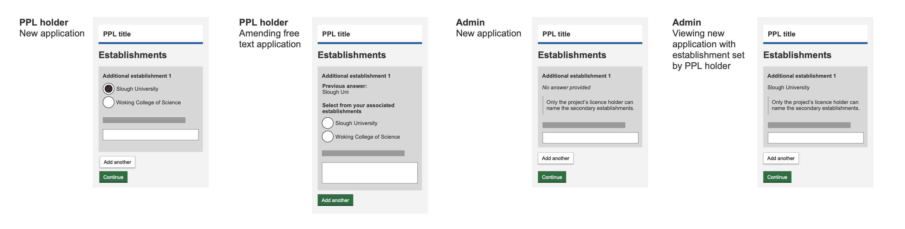

# Summary as of Wednesday 08 July 2020 

# Sprint 62

## Just Done
* Investigation into improved search infrastructure
* Replace select boxes with auto-complete components when choosing from long lists of people - working software
* Allow external users with no licences or roles to disassociate themselves from establishments - working software
* Fix erroneous email notifications for ASRU admin functions - working software
* Changes for task statuses and activity logs - content design
* Improving comments - initial design
* Adding secondary availability to PPLs in data - high-level design
* Research with inspectors on statutory deadlines - user research

## About to Do/Doing
* Change password functionality - working software
* Store RA conditions directly in data to facilitate reporting and querying - working software
* Investigation into security impacts of building new search infrastructure into live
* Include 'general constraints' in PPL applications and review guidance for applicants checking their NTS - content design
* Improvements to the performance metrics page - design
* Retrospective assessments - user research 

## Bugs Fixed this week
The following bugs were fixed this week.
[Bug Fixes week to Wednesday 08 July 2020](graphs/bugs08072020.png)

We planned the following issues in this sprint 
[Sprint 62](graphs/sprint08072020.png)

## Support tickets and known issues
[Link to Support Board](https://collaboration.homeoffice.gov.uk/jira/secure/RapidBoard.jspa?rapidView=1717&selectedIssue=ASSB-253)

[Support board - cached](graphs/supportBoard08072020.png)

## Click here for metrics / progress against plan
[Sprint 62](graphs/progress08072020.png)

[Post Release Roadmap](graphs/roadmap08072020.png)

## These are the goals for the current sprint:

1. User needs research for retrospective assessments 
2. Design and content - improvements to the performance metrics page 
3. Working software - change password

## These were the goals for the previous sprint:

1. Content design for statutory deadlines 
2. Explore search - fuzzy matching 
3. Design improve commenting on applications 
4. Conduct user research with inspectors on statutory deadlines

## Sample Design Prototypes
###  Adding secondary availability to PPLs in data

 

## Google Analytics for this report
[Google Analytics](graphs/GA08072020.png)

