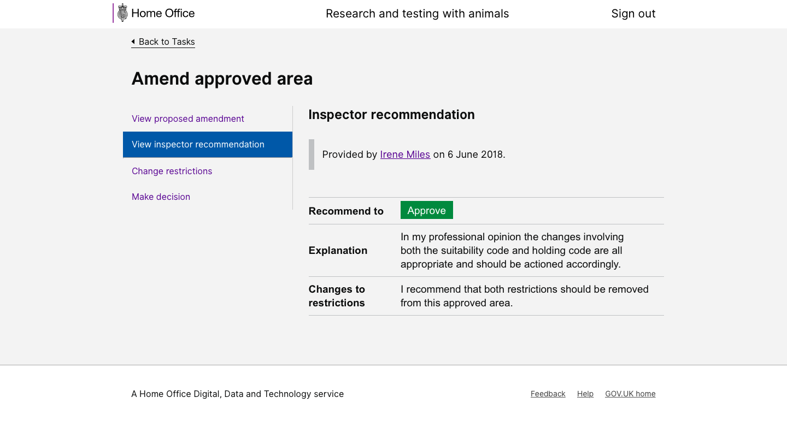
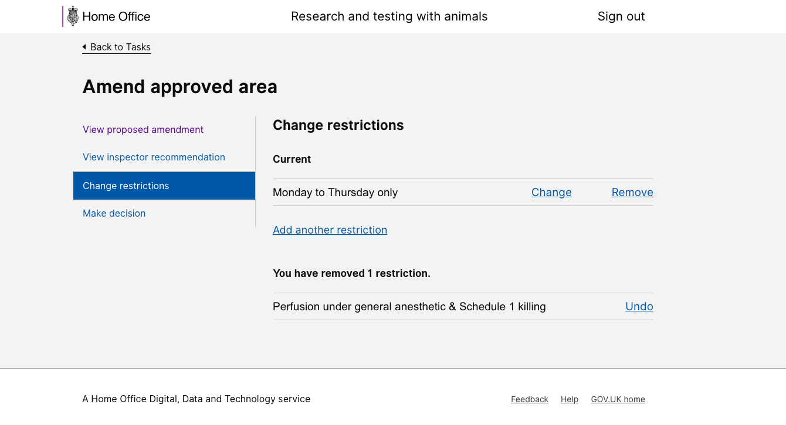

# Summary as of 8th August 2018 
## What's Blocking us / Issues
* Discussions are continuing to get final approval for the contract for the exisiting system 

## Just Done
* Demonstrated working software for creation of new user accounts
* Demonstrated Initial designs for PIL application

## About to Do/Doing
* Continuing design work on PIL applications in preparation for User Research
* Produce designs for PEL amendments for named people in preparation for User Research
* Develop working software for end-to-end creation of user accounts

## Things to be aware of
* A new software developer joined the team this week, another new software developer will join the team next week
* Marvell Consulting have a new office space in London Bridge which the team will work from on occasion (specifically to help ease the burden of SC clearance).  Members of the team will continue to also work in Lunar house and occupy our bank of desks on the 18th floor
* We are also interviewing for a new designer to replace the designer who is leaving the team

## Click here for our High-Level Road map
[Link to Live Road map in Trello](https://trello.com/b/gDQdE01u/asl-roadmap)    [\(Cached Image\)](graphs/ASLRoadMap08082018.jpg)

## Click here for metrics / progress against plan
[RRRWEEK_SPRINT_RELEASE](graphs/progress08082018.png)

## Risks
[Links to Project Risks in Trello](https://trello.com/b/VuFuCL7t/risk-register-and-kpis-asl-delivery)    [\(Cached Image\)](graphs/ASLRiskRegister08082018.jpg)

[Risk Management Chart](graphs/risk08082018.png)

## Progress against previous Sprint Goals

Goal:“Create User” - end-to-end journey in working software
*This goal was not acheived "end-to-end" because of critical encountered in the database access layer. We have adopted a different approach which should also help with database migrations. We aim to complete Create User in this sprint*
Goal:Get designs ready for User Research on PILs
*This goal was intended to stretch across two sprints and in continuing in this sprint*
Goal:Test PEL amendment journeys with licensing team, so ready for development
*Completed*

## Sprint Planning
We planned the following issues in sprint planning today [Link to Issues in Jira](https://jira.digital.homeoffice.gov.uk/secure/RapidBoard.jspa?rapidView=261)    [\(Cached Image\)](graphs/sprint08082018.png)

Goals for the sprint are
* Complete the "Create User" journey, end-to-end as working software
* Get PIL application and Profiles designs ready for User Research

## Sample Design Prototypes
Some screenshots from the prototypes that were tested with licence offices in this sprint for approval of PEL amendments.

 

