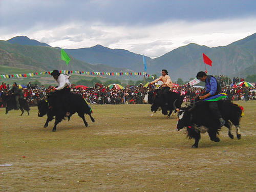
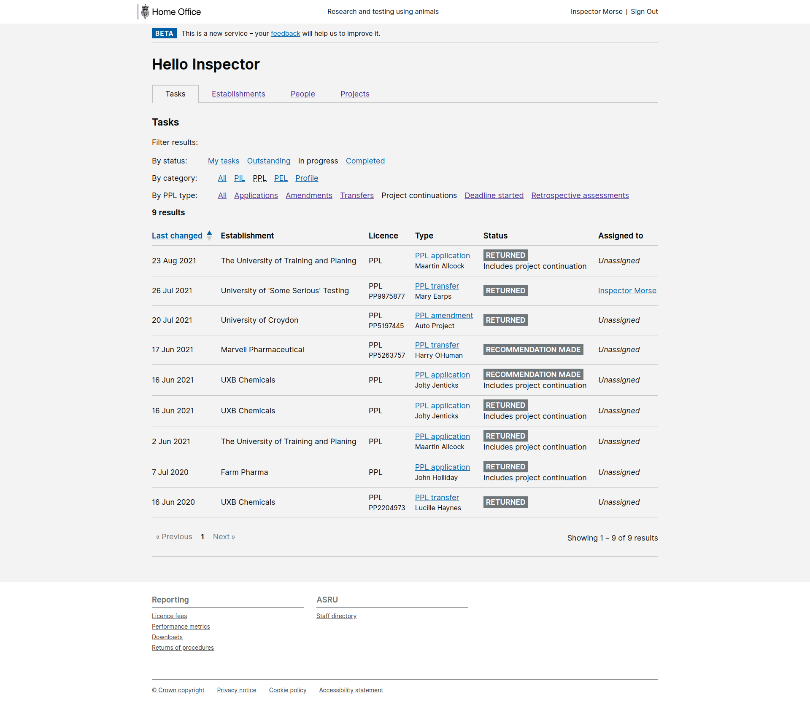

# Summary as of Wednesday 08 September 2021 

# Sprint 92 (Yak)

## Just Done
* Designing content improvements to the page where ASRU can download data from ASPEL - design
* Redesigning users' account pages to remove the option to subscribe to ASRU's operational newsletter - design
* Add filters to ASRU task lists - working software
* Add AWERB endorsement declaration step to changes of PPL licence holder - working software
* Fix issues with returns spreadsheet columns in ROPs data exports - working software

## About to Do/Doing
* Reviewing old tickets for content changes to the PPL application - to discuss with ASRU - design
* Investigation of issues with training records in PPL review phase - working software
* Removal of inspector/SPoC assignment code - working software

## Bugs Fixed this week
The following bugs were fixed this week.
[Bug Fixes week to Wednesday 08 September 2021](graphs/bugs08092021.png)

We planned the following issues in this sprint 
[Sprint 92](graphs/sprint08092021.png)

## Support tickets and known issues
[Link to Support Board](https://collaboration.homeoffice.gov.uk/jira/secure/RapidBoard.jspa?rapidView=1717&selectedIssue=ASSB-253)

[Support board - cached](graphs/supportBoard08092021.png)

## Click here for metrics / progress against plan
[Sprint 92](graphs/progress08092021.png)

### We set these goals for the current sprint (92, Yak)
1) Continue to address ROPs issues (Yak)

### We set these goals for the previous sprint (91, Xenopus)
1) Complete outstanding ROPs issues 
2) Review role descriptions for ASRU users

## Screenshots of working software
### Filtering of task lists for inspectors

 

## Google Analytics for this report
[Google Analytics](graphs/GA08092021.png)

