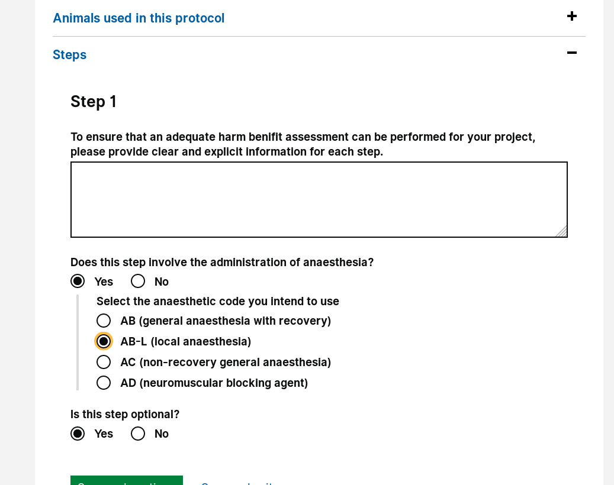

# Summary as of 9th January 2019 

# Sprint 24

## Just Done
* Demonstration of working software for PPL drafting tool
* Iteration of design for PPL application
* Communicated user feedback on new sections of PPL form 

## About to Do/Doing
*  Design for viewing and reviewing PPL
*  Design PPL Validation Rules
*  Test Content for PPL
*  Working software for PPL Draft Tool
*  Working Create Amend Destroy any User Role

## Things to be aware of
* The meeting with the technical design authority has been pushed back
 
## Click here for Prioritised Road Map
[Prioritised Road Map](https://trello.com/b/p7x9hbPV/prioritised-roadmap)    [\(Cached Image\)](graphs/ASLRoadMap09012019.jpg)

## Click here for metrics / progress against plan
[Week 1 - Sprint 24 - Release 1](graphs/progress09012019.png)

## Burnup Chart

[Burnup Chart](burnup09012019.md)

## Risks
[Links to Project Risks in Trello](https://trello.com/b/VuFuCL7t/risk-register-and-kpis-asl-delivery)    [\(Cached Image\)](graphs/ASLRiskRegister09012019.jpg)

[Risk Management Chart](graphs/risk09012019.png)

## Sprint Planning
* We planned the following issues in sprint planning today [Link to Issues in Jira](https://jira.digital.homeoffice.gov.uk/secure/RapidBoard.jspa?rapidView=261)    [\(Cached Image\)](graphs/sprint09012019.png)

Our goals for the previous sprint were:

1. Advanced user input in PPL prototype
2. User feedback on new sections of PPL form
**(Done)**
3. Iterate protocols for PPL
**(Done)**
4. Explore PPL Application types/routing 
**(Continuing)**

Our goals for the sprint are:
1. Design for viewing and reviewing PPL 
2. Design PPL Validation Rules 
3. Test Content for PPL 
4. PPL Draft Tool - Release Candidate Zero 
5.  Create Amend Destroy any User Role 

## Screenshots of the PPL application prototype

 
 

## Google Analytics for this report

This shows:
* total number of users
* number of new users

[Google Analytics](graphs/GA09012019.jpg)

