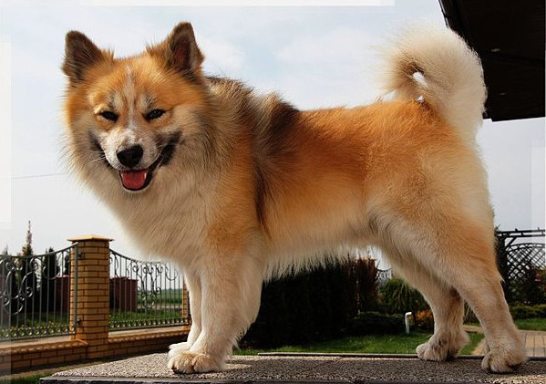
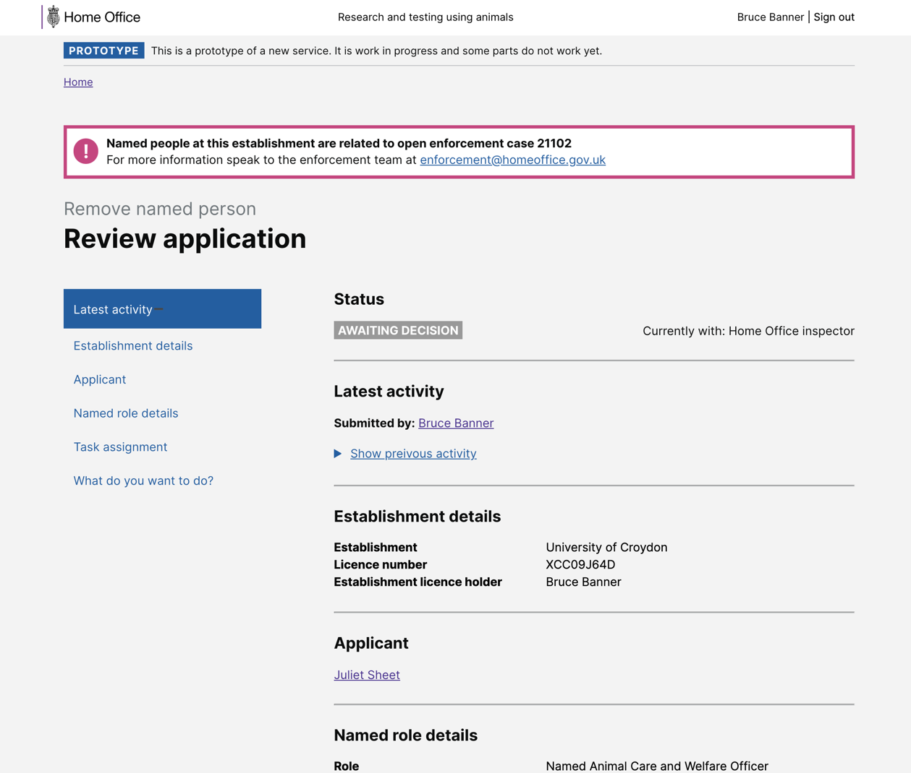
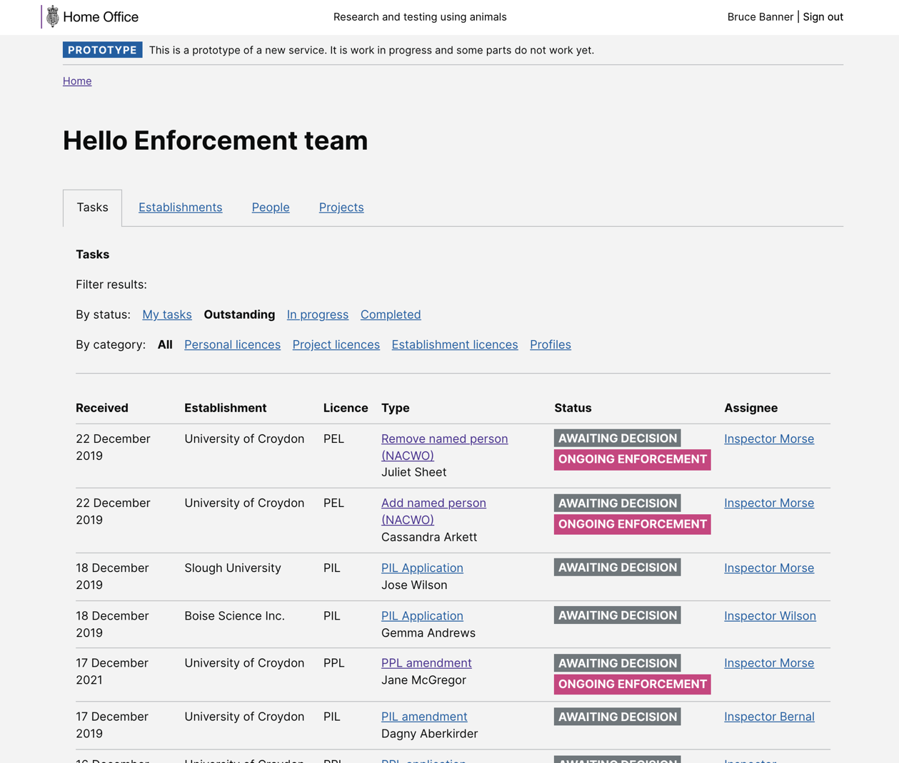

# Summary as of Wednesday 09 February 2022 

# Sprint 102 (Icelandic sheepdog)

## Just Done
* completed round two of user testing of compliance flags, completed analysis - research and design
* feature: added notification banners for due / overdue ROPs - working software
* fix: Prevent table renderer ignoring empty cells. This resulted in tables containing empty cells to have content in the same row be shifted to the left - working software
* improvement: general constraints are now shown in application downloads (PDF / Word) - working software
* fix: tables in protocol steps had white text on white background, making them impossible to read - working software
* improvement: it is now much more obvious that tables which are larger than the available width can be scrolled horizontally - working software

## About to Do/Doing
* final changes to compliance flags based on user feedback – design
* improvement: clearer content for tasks which did not require approval by ASRU - working software
* improvement: add a "last updated" timestamp to billing contact/PO data - working software
* improvement: improve security scanning of dependencies to allow fine-grained configuration of whitelisted advisories - working softare

## Bugs Fixed this week
The following bugs were fixed this week.
[Bug Fixes week to Wednesday 09 February 2022](graphs/bugs09022022.png)

We planned the following issues in this sprint 
[Sprint 102](graphs/sprint09022022.png)

## Support tickets and known issues
[Link to Support Board](https://collaboration.homeoffice.gov.uk/jira/secure/RapidBoard.jspa?rapidView=1717&selectedIssue=ASSB-253)

[Support board - cached](graphs/supportBoard09022022.png)

## Click here for metrics / progress against plan
[Sprint 102](graphs/progress09022022.png)

[Post Release Roadmap](graphs/roadmap09022022.png)

1) Get enforcement flags ready for development (user research and design) 2) Reporting and metrics pages - release candidate (development) Icelandic Sheepdog

PREVIOUS_SPRINT_GOALS

## Sample Design Prototypes
### Compliance flags designs

 

 

## Google Analytics for this report
[Google Analytics](graphs/GA09022022.png)

