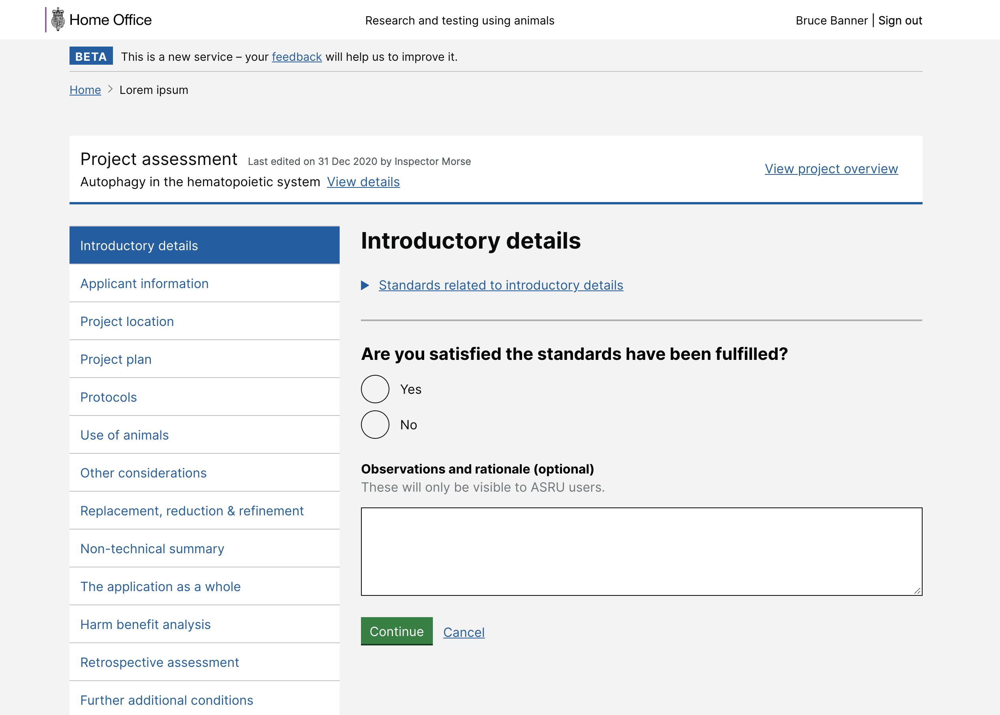

# Summary as of Wednesday 09 September 2020 

# Sprint 66

## Just Done
* Reviewed existing research and designs for PPL assessments and agreed next steps - user research
* Reviewing designs for PPL assessments - design
* Continued work on applying for category E PILs - working software
* Improved statutory deadline display in PPL task pages - working software
* Accessibility improvements related to text colour contrast - working software
* Fixed issue with additional establishments and POLEs being retained on PPL documents - working software
* Added contact page for external users - working software

## About to Do/Doing
* Preparing for a round of testing with admins and PPL holders for - user research: 
	1. Improving the grouping of the NTS questions in the PPL application 
	2. Making navigation improvements to the PPL journey to accommodate more features
* Restructuring PPL and NTS - design
* Allow inspectors to provide reasons for expired PPL statutory deadlines when processing PPL applications - user research
* Continued work on applying for and granting category E PILs - user research

## Bugs Fixed this week
The following bugs were fixed this week.
[Bug Fixes week to Wednesday 09 September 2020](graphs/bugs09092020.png)

We planned the following issues in this sprint 
[Sprint 66](graphs/sprint09092020.png)

## Support tickets and known issues
[Link to Support Board](https://collaboration.homeoffice.gov.uk/jira/secure/RapidBoard.jspa?rapidView=1717&selectedIssue=ASSB-253)

[Support board - cached](graphs/supportBoard09092020.png)

## Click here for metrics / progress against plan
[Sprint 66](graphs/progress09092020.png)

[Post Release Roadmap](graphs/roadmap09092020.png)

## These are the goals for the current sprint:

1. Statutory deadline handling - working software 
2. Reviewing PPL assessments - design 
3. Review use of declarations - content design

## These were the goals for the previous sprint:

1. Design - Publishing process for NTSs and RAs 
2. Dev - Apply for Cat E PILs 
3. General - Accessibility improvements

## Sample Design Prototypes

 

## Google Analytics for this report
### Revisiting PPL assessments
[Google Analytics](graphs/GA09092020.png)
