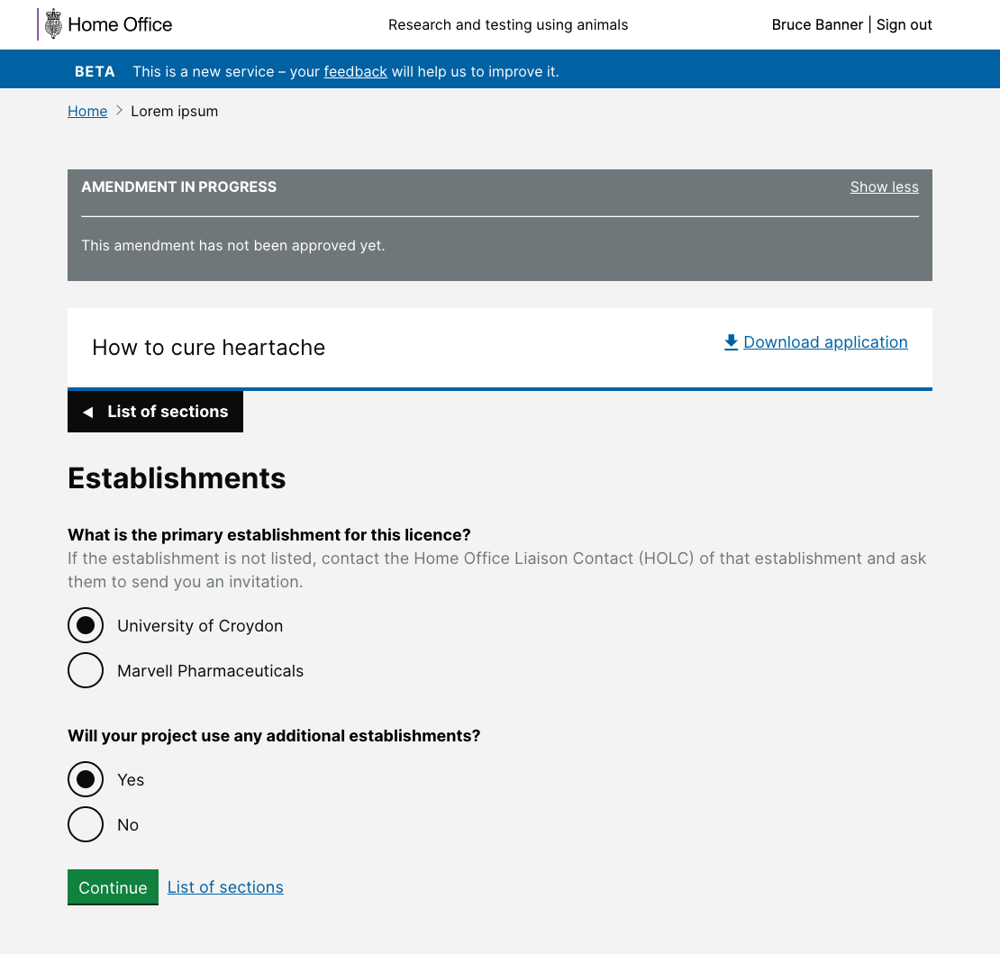
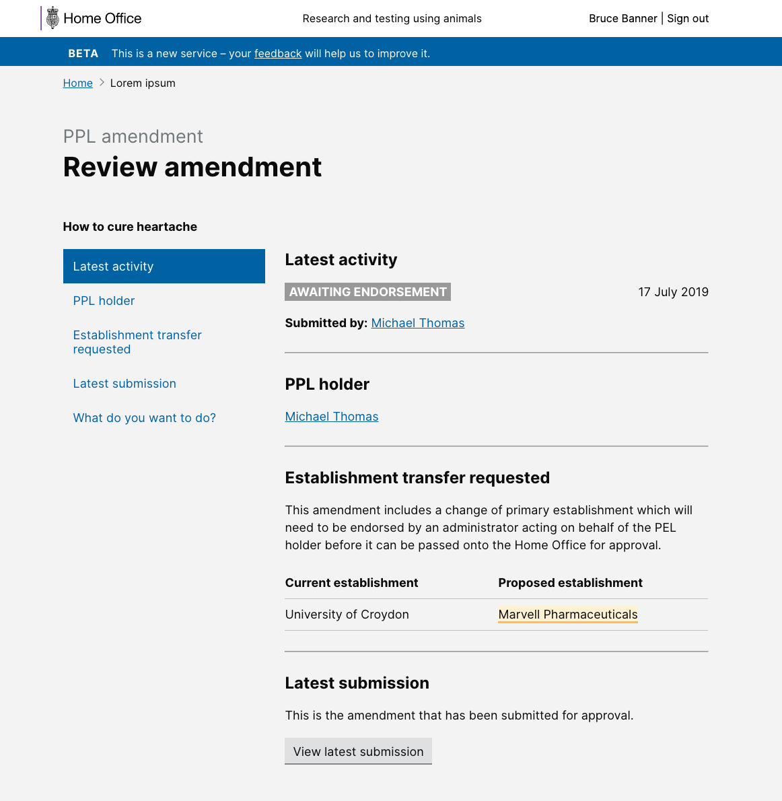

# Summary as of 9th October 2019 

# Sprint 43

## Just Done
* RTE tooltips
* Reissued PIL has new grant date
* Hide nprc name if same as PELh
* Fixed bug with table rendering in Word documents

## About to Do/Doing
* PIL and PPL transfer research
* Edit comments made as part of review process

## Bugs Fixed this week
The following bugs were fixed this week.
[Bug Fixes week to 9th October](graphs/bugs09102019.jpg)

We planned the following issues in this sprint 
[Sprint 43](graphs/sprint09102019.png)

## Support tickets and known issues
[Link to Support Board](https://jira.digital.homeoffice.gov.uk/secure/RapidBoard.jspa?rapidView=331&selectedIssue=ALS-47)

[Support board - cached](graphs/supportBoard09102019.jpg)

## Click here for metrics / progress against plan
[Week 1 - Sprint 43 - Release 1](graphs/progress09102019.png)

Our goals for the current sprint are:
1. Transfer PILs and PPLs between establishments, UR & Design 
2. PPL Approval - working software

## Sample Design Prototypes

 

 

## Google Analytics for this report
[Google Analytics](graphs/GA09102019.jpg)

