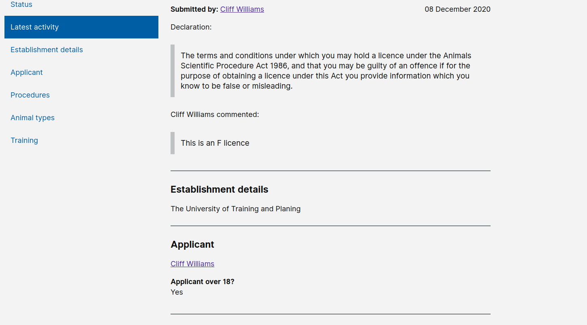

# Summary as of Wednesday 09 December 2020 

# Sprint 73.0

## Just Done
* TEXT_HERE
* TEXT_HERE
* TEXT_HERE

## About to Do/Doing
* TEXT_HERE
* TEXT_HERE
* TEXT_HERE

## Bugs Fixed this week
The following bugs were fixed this week.
[Bug Fixes week to Wednesday 09 December 2020](graphs/bugs09122020.png)

We planned the following issues in this sprint 
[Sprint 73.0](graphs/sprint09122020.png)

## Support tickets and known issues
[Link to Support Board](https://collaboration.homeoffice.gov.uk/jira/secure/RapidBoard.jspa?rapidView=1717&selectedIssue=ASSB-253)

[Support board - cached](graphs/supportBoard09122020.png)

## Click here for metrics / progress against plan
[Sprint 73.0](graphs/progress09122020.png)

[Post Release Roadmap](graphs/roadmap09122020.png)

1) Test ROPs with internal users - design and user research 2) Release PPL for content search for ASRU - working software (Fox)

1) Full content search on PPLs - working software 2) Prepare and plan second iteration of ROPs testing (user research and design) Elephant

## Sample Design Prototypes

 

 

## Google Analytics for this report
[Google Analytics](graphs/GA09122020.png)

