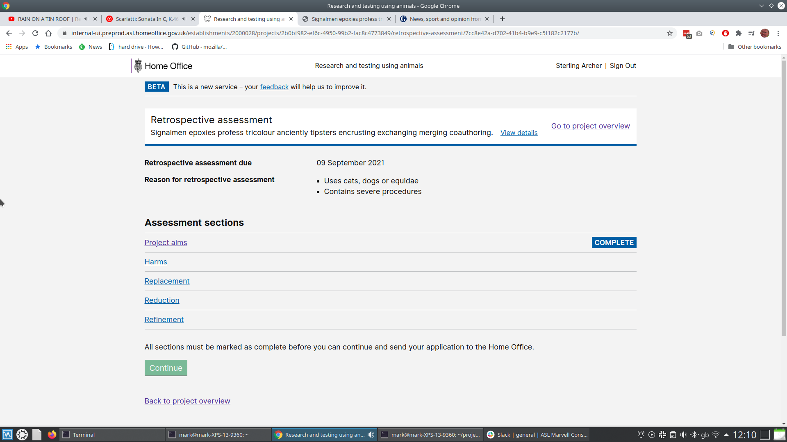

# Summary as of Wednesday 10 March 2021 

# Sprint 79

## Things to bear in mind
* This blog post discusses the research and design approach that we took on this project:
 
[Showing the rewards of user-centred service design at scale](https://services.blog.gov.uk/2021/03/05/showing-the-rewards-of-user-centred-service-design-at-scale/)

## Just Done
* Guidance for completing a ROP has been drafted - content design
* Formatting tweaks to additional availability - working software
* Include reasons for retrospective assessment as part of the RA submission form - working software

## About to Do/Doing
* Word downloads of previous versions of PPL applications - working software
* Include RA reason in the pdf export of NTS - working software
* Inform PPL applicants of mandatory requirements for PPL training - working software

## Bugs Fixed this week
The following bugs were fixed this week.
[Bug Fixes week to Wednesday 10 March 2021](graphs/bugs10032021.png)

We planned the following issues in this sprint 
[Sprint 79](graphs/sprint10032021.png)

## Support tickets and known issues
[Link to Support Board](https://collaboration.homeoffice.gov.uk/jira/secure/RapidBoard.jspa?rapidView=1717&selectedIssue=ASSB-253)

[Support board - cached](graphs/supportBoard10032021.png)

## Click here for metrics / progress against plan
[Sprint 79](graphs/progress10032021.png)

[Post Release Roadmap](graphs/roadmap10032021.png)

[Roadmap Visualisaton (Experimental) ](roadmapVisualisation24022021.md)

## This is the goal for the current sprint
1. RoPs submission release candidate - working software (Liger)

## Screenshot of new working software
### Include reasons for retrospective assessment as part of the RA submission form 

 

## Google Analytics for this report
[Google Analytics](graphs/GA10032021.png)

