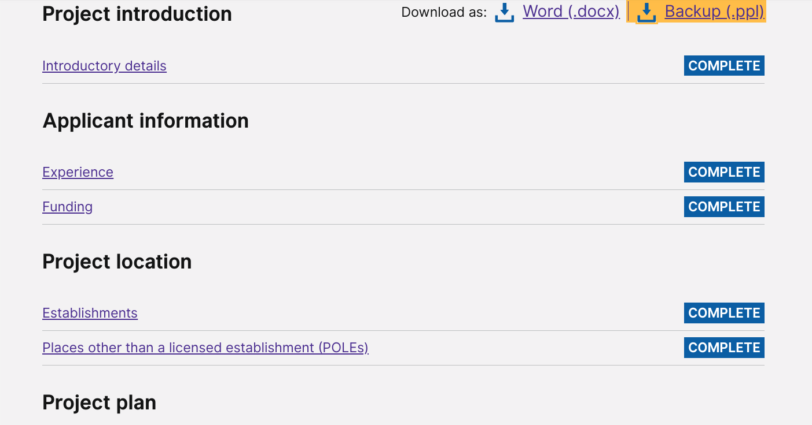
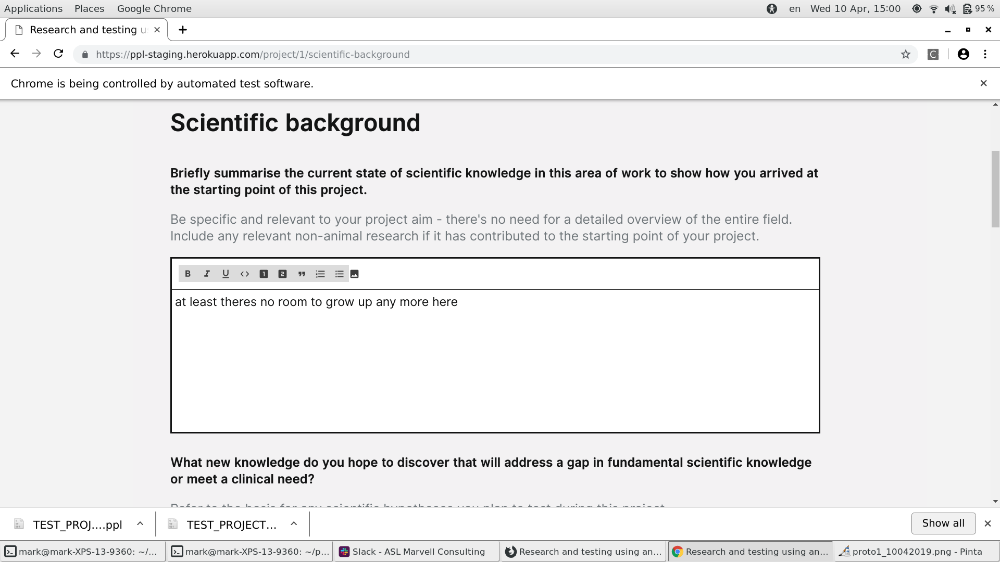

# Summary as of 10th April 2019 

## Just Done
* RRRTEXT_FILL

## About to Do/Doing
* "My tasks" list - working software
* Legact PPL - PDF export of protocols
* Content design digital view of granted project licence

## Things to be aware of

## Click here for Prioritised Road Map
[Prioritised Road Map](https://trello.com/b/p7x9hbPV/prioritised-roadmap)    [\(Cached Image\)](graphs/ASLRoadMap10042019.jpg)

## Click here for metrics / progress against plan
[RRRWEEK_SPRINT_RELEASE](graphs/progress10042019.png)

## Burnup Chart

[Burnup Chart](burnup10042019.md)

## Risks
[Links to Project Risks in Trello](https://trello.com/b/VuFuCL7t/risk-register-and-kpis-asl-delivery) 
[Link to Risk Chart](graphs/risk10042019.png)

## Sprint Planning
* We planned the following issues in sprint planning today [Link to Issues in Jira](https://jira.digital.homeoffice.gov.uk/secure/RapidBoard.jspa?rapidView=261)    [\(Cached Image\)](graphs/sprint10042019.png)

Our goals for the sprint are:
1. Design view of licences - PPLs
2. User research - requirements for other kinds of PPL 
3. "My tasks" list - working software 
4. pdf export of PPLs

## Screenshots of the PPL application prototype

 

 

## Google Analytics for this report

This shows:
* total number of users
* number of new users

[Google Analytics](graphs/GA10042019.jpg)

