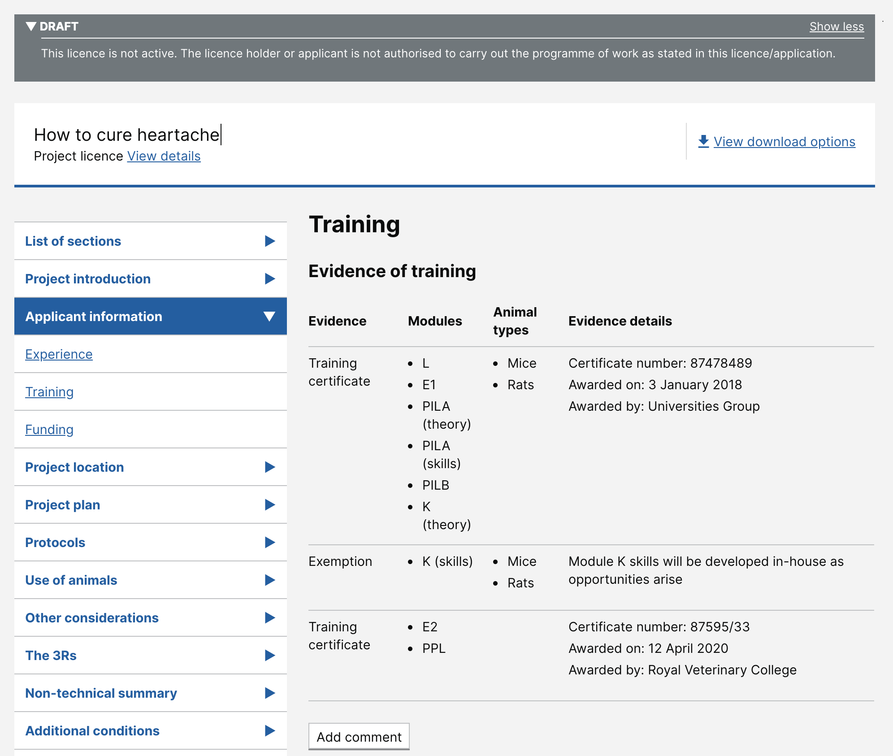

# Summary as of Wednesday 10 June 2020 

# Sprint 60

## Just Done
* Related tasks view on all licences/profiles - working sofware
* PPL authorisation and condition report - working software
* Fix issue with closed tasks not showing correct “before” values - note: this fix does not apply retrospectively to previously closed tasks
* Update handling of statutory deadlines - design
* Move users training and exemptions to their profile for use on both PPL and PIL applications - design
* Content design for generic success messages

## About to Do/Doing
* Reporting - PPL statutory deadline, RA reporting, PIL reporting
* ASRU profiles - working software
* Creating a landing page for each approved area - working software
* Improvements to task history - design
* Content iterations for PIL E journey

## Bugs Fixed this week
The following bugs were fixed this week.
[Bug Fixes week to Wednesday 10 June 2020](graphs/bugs10062020.png)

We planned the following issues in this sprint 
[Sprint 60](graphs/sprint10062020.png)

## Support tickets and known issues
[Link to Support Board](https://collaboration.homeoffice.gov.uk/jira/secure/RapidBoard.jspa?rapidView=1717&selectedIssue=ASSB-253)

[Support board - cached](graphs/supportBoard10062020.png)

## Click here for metrics / progress against plan
[Sprint 60](graphs/progress10062020.png)

[Post Release Roadmap](graphs/roadmap10062020.png)

## These are the goals for the current sprint:

1. Complete the research on Cat E PILs 
2. Design - improve task history 
3. Content design - complete content for PIL-E 
4. Working software - reporting RA, PPL SLAs and PILs

## These were the goals for the previous sprint:

1. Working software - show tasks related to a licence ***[Done]*** 
2. Design - manage statutory PPL deadlines ***[Done]***
3. Content - review success messages ***[Done]***
4. User Research Cat-E with existing PIL holders ***[Done]***

## Sample Design Prototypes

 

## Google Analytics for this report
[Google Analytics](graphs/GA10062020.png)

