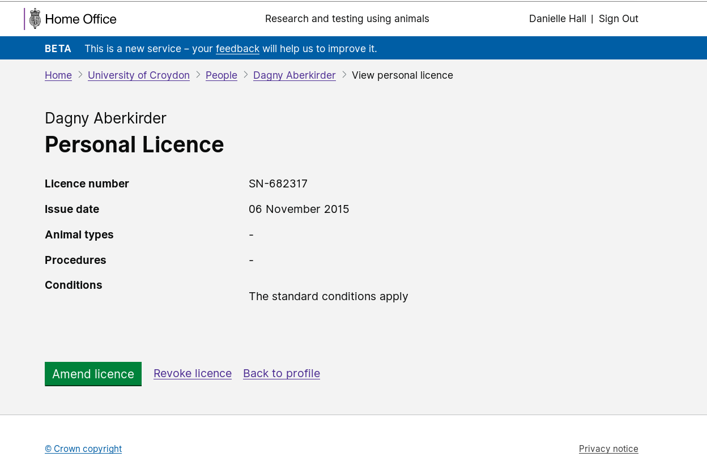
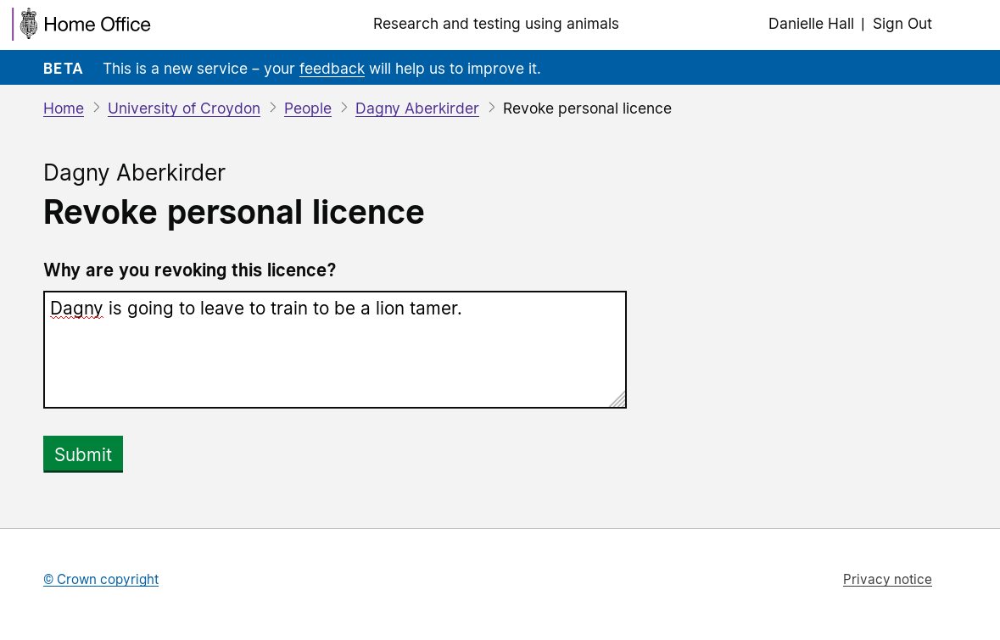

# Summary as of 10th July 2019 

# Sprint 37

## What's Blocking us / Issues
* We are still working to get authority to operate (ATO) 

## Just Done
* Revoke pil (working software)
* Split auths and conditions (working software)
* Fix word export (working software)

## About to Do/Doing
* View of granted PIL (working software)

## Click here for Prioritised Road Map
[Prioritised Road Map](graphs/ASLRoadMap10072019.jpg)

## Click here for metrics / progress against plan
[Week 1 - Sprint 37 - Release 1](graphs/progress10072019.png)

## Burnup Chart - Release candidates and release dates
We are now so near release that the burnup chart is meaningful.
As discussed at the Show and Tell, in future weeks we will publish reports on the contents of likely release candidates and their release dates.

## Risks
[Links to Project Risks in Trello](https://trello.com/b/VuFuCL7t/risk-register-and-kpis-asl-delivery) 
[Link to Risk Chart](graphs/risk10072019.png)

## Sprint Planning
* We planned the following issues in sprint planning [Link to Issues in Jira](https://jira.digital.homeoffice.gov.uk/secure/RapidBoard.jspa?rapidView=261)    [\(Cached Image\)](graphs/sprint10072019.png)

### Our goals for the previous sprint were:
1. Complete Inspector Roadshow ***[Done]***
2. Prepare for HOLTIF meeting ***[Done]***
3. Print view PPL granted licence ***[Done]***
4. ATO ***[In progress]***
5. PPL discard project amendments ***[Done]***
6. Category E Pils - ***[Research in progress]***

### Our goals for the sprint are:
1. ATO 
2. Digital and Print view for new and legacy licences - working software 
3. Declarations review 
4. Decide release schedule 
5. High level plan for Beta service assessment 
6. Cat E Pils - Design

## Screenshots of the working software 

 

 

## Google Analytics for this report
[Google Analytics](graphs/GA10072019.jpg)

