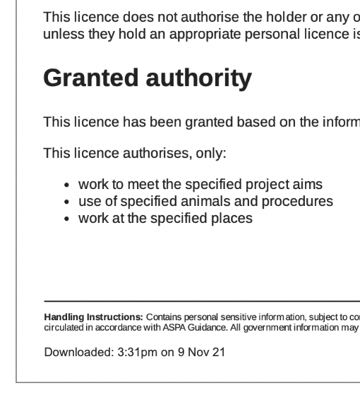

# Summary as of Wednesday 10 November 2021 

# Sprint 97

## Just Done
* TEXT_HERE
* TEXT_HERE
* TEXT_HERE

## About to Do/Doing
* TEXT_HERE
* TEXT_HERE
* TEXT_HERE

## Bugs Fixed this week
The following bugs were fixed this week.
[Bug Fixes week to Wednesday 10 November 2021](graphs/bugs10112021.png)

We planned the following issues in this sprint 
[Sprint 97](graphs/sprint10112021.png)

## Support tickets and known issues
[Link to Support Board](https://collaboration.homeoffice.gov.uk/jira/secure/RapidBoard.jspa?rapidView=1717&selectedIssue=ASSB-253)

[Support board - cached](graphs/supportBoard10112021.png)

## Click here for metrics / progress against plan
[Sprint 97](graphs/progress10112021.png)

[Post Release Roadmap](graphs/roadmap10112021.png)

1) Conduct ROPs user research sessions 2) Design new PPL submission flow. 3) 2022 Rops release candidate (Dragonfly)

PREVIOUS_SPRINT_GOALS

## Sample Design Prototypes

 

 

## Google Analytics for this report
[Google Analytics](graphs/GA10112021.png)

