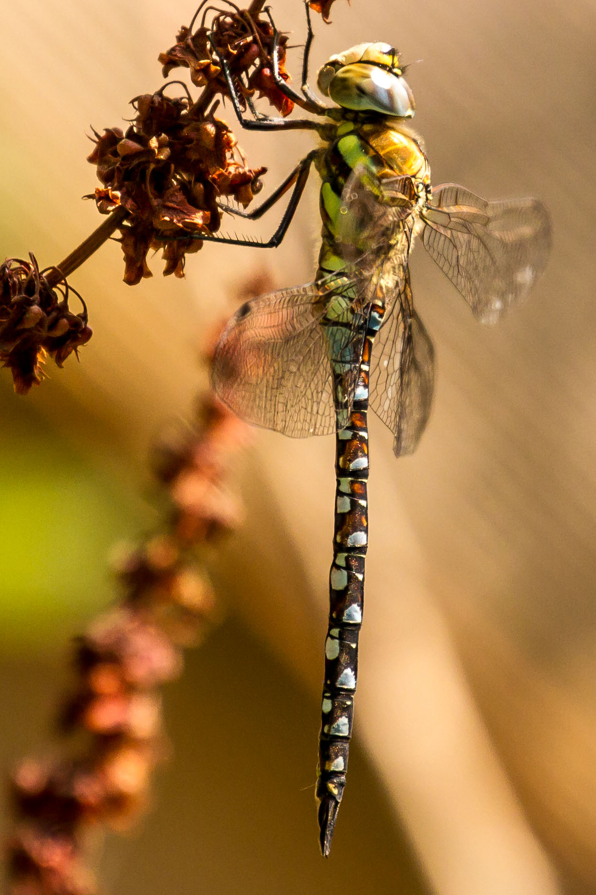

# Summary as of Wednesday 10 November 2021 

# Sprint 97 (Dragonfly)

## Just Done
* Review of permissions around application/amendment submissions, adding a download date to PDF downloads - design
* Fix issue with ROPs species being removed when editing after adding procedures - working software
* Add messaging to ROPs setup where fields are disabled after being added to procedures - working software
* Fix issue with users with revoked PILs being prompted for 5 year review - working software
* Improvements to search match highlighting in person and task searches - working software
* Filter PPL collaborator notifications based on establishment affiliation to avoid notifying removed collaborators - working software

## About to Do/Doing
* Schedule sessions with PPL holders for RoPs - user research
* Hold RoPs feedback sessions - user research
* Test new 'overdue' columns in RA and ROP reports - user research
* Updating designs around submission processes, exploring compliance flags within ASPEL - design
* Preparation for making 2022 ROPs submission available in January - working software
* Fix playback of authorisations in ROPs setup questions for pre-2019 PPLs - working software
* Improvements to content in ROPs submission journey - working software

## Bugs Fixed this week
The following bugs were fixed this week.
[Bug Fixes week to Wednesday 10 November 2021](graphs/bugs10112021.png)

We planned the following issues in this sprint 
[Sprint 97](graphs/sprint10112021.png)

## Support tickets and known issues
[Link to Support Board](https://collaboration.homeoffice.gov.uk/jira/secure/RapidBoard.jspa?rapidView=1717&selectedIssue=ASSB-253)

[Support board - cached](graphs/supportBoard10112021.png)

## Click here for metrics / progress against plan
[Sprint 97](graphs/progress10112021.png)

[Post Release Roadmap](graphs/roadmap10112021.png)

### We set the following goals for this sprint
1. Conduct ROPs user research sessions 
2. Design new PPL submission flow. 
3. 2022 Rops release candidate

### We set the following goals for the previous sprint
1. Review permissions around submitting PPLs ***[Done]***
2. Improved visibility of overdue ROPs and RAs ***[Done]***

## Sample Design Prototypes
### Show downloaded date on pdf downloads

 

## Google Analytics for this report
[Google Analytics](graphs/GA10112021.png)

