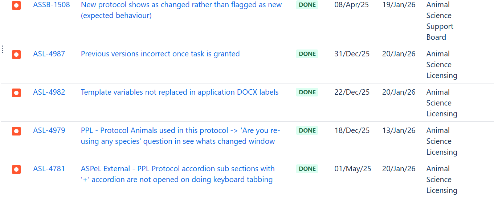
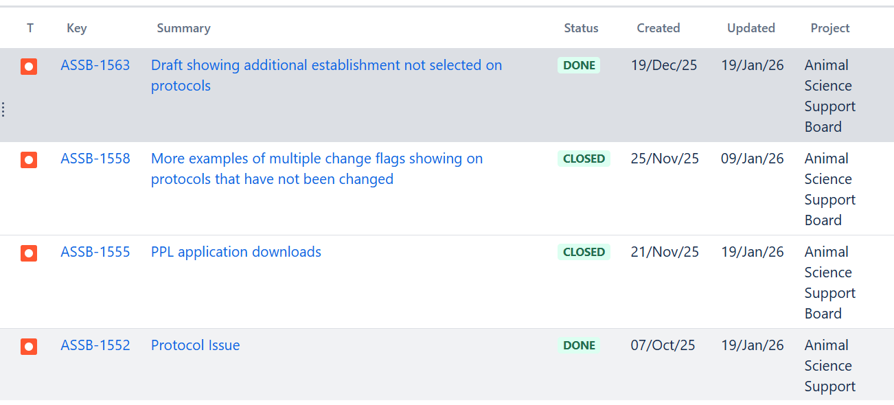
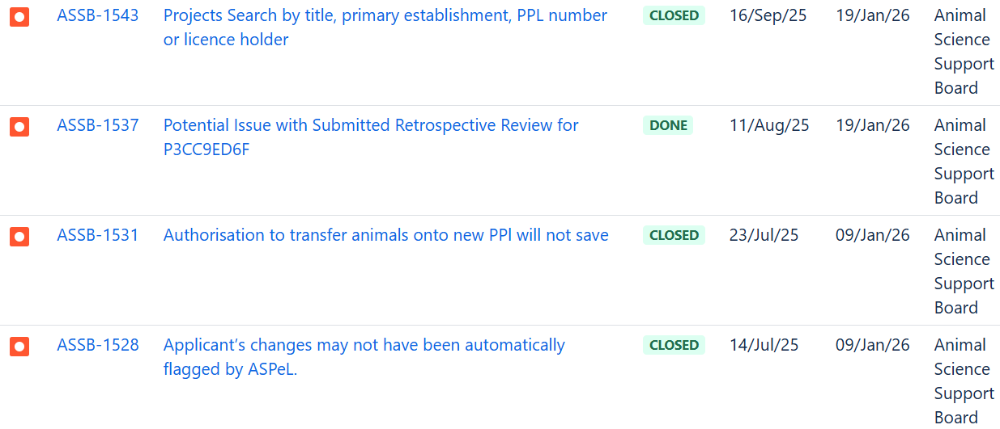

# Summary as of Wednesday 11th February 2026

## Future research and recruitment 

Thank you for your continued involvement in user research for ASPeL– your participation is integral to understanding the user experience. The research on ASPeL features continues. Please contact ASPELTechnicalQueries@homeoffice.gov.uk to participate. Thank you.  
 
# Sprint: 165(Tamarin)

Attribution:

Interesting facts about Tamarins: The adult males, subadults, and juveniles in the group assist with caring for the young, bringing them to their mother to nurse.

# Completed this Sprint, (21 out of 36 stories, tasks, and bugs completed, with bug fixes given priority.)
1) Four standard protocols tickets completed during the Sprint behind a feature flag until all.
2) Three tickets were done for the NTS DOCX document behind a featuire flag.
3) HBA replacement was tested end to end and deployed into production.
4) We added the 2027 Bank holidays to ASPeL as part of maintenance
5) We added rules for 'new' and 'added' tags on change highlighting in PPL.
6) We fixed the new comment display in the fate of animals section.
   
 

	

# Bugs done or closed this Sprint

 

# New Sprint 165 (tamarin)

Planned for this Sprint:
1. Resolve remaining reported Change highlighting issues.
2. Resolve remaining reported Comment display issues.
3. Start Named Person work to update screens, based on the feedback from the first User Acceptance Testing.
4. Continue Amazon Web Services upgrade.
5. Continue Standard Protocols content work (for fixed SP4).
6. Build DOCX exporter for Non Technical Summary.
7. Continue Cat E PIL work.

## Things to bear in mind
Kindly let us know how we are doing in keeping you informed. We appreciate your feedback on the content of this report. Thank you.

