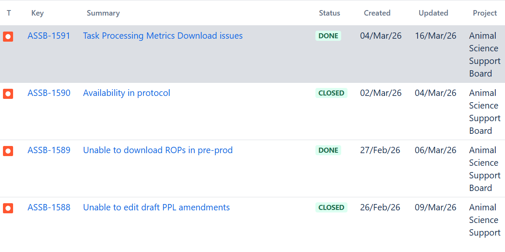
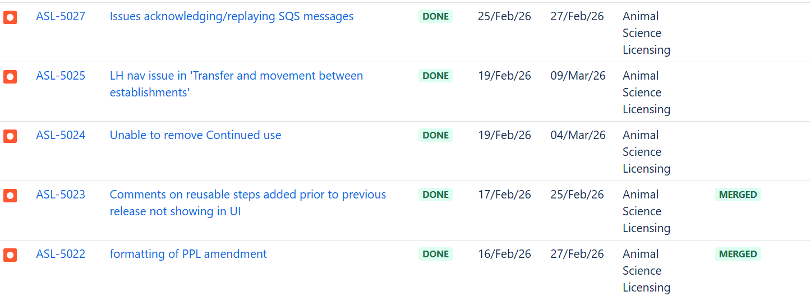
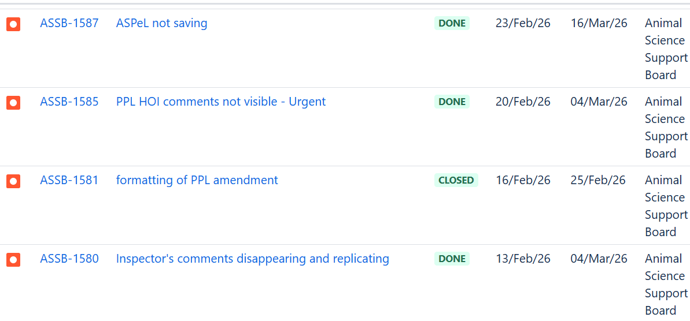
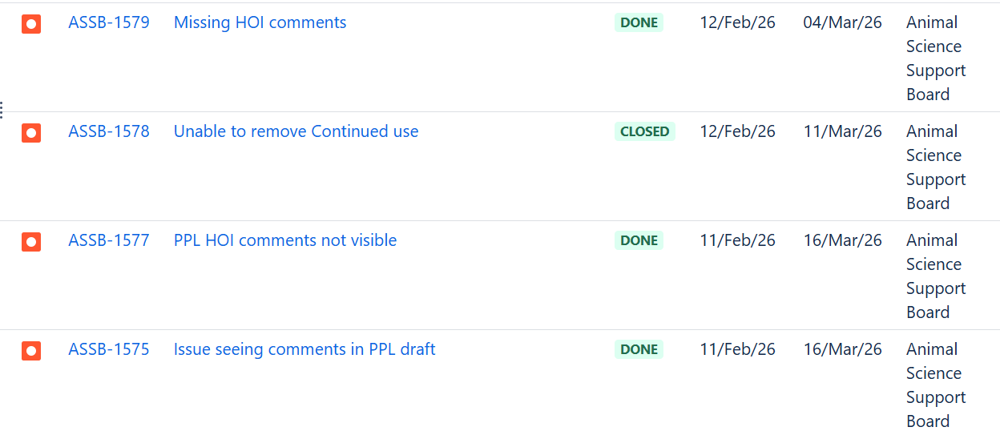
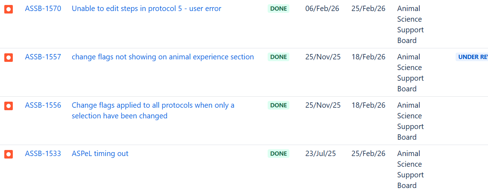
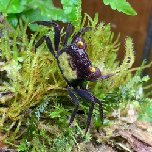

# Summary as of Wednesday 11th March 2026

## Future research and recruitment 

Thank you for your continued involvement in user research for ASPeL– your participation is integral to understanding the user experience. The research on ASPeL features continues. Please contact ASPELTechnicalQueries@homeoffice.gov.uk to participate. Thank you.  
 
# Completed Sprint 166 (uakari)

Attribution:

Interesting facts about uakaris:They are small, quiet, intelligent and active animals.

# Sprint Completion(A total of 21 issues were completed out of 33 brought into the Sprint. Work done included tasks, stories and bugs. The fixes applied to ASPeL as a result of the outage resulted in a larger storage on its database)
1) Seven Tech Debt tickets, including a bug, related to-the Amazon Website Service(AWS) upgrade were completed during this Sprint
2) ASPeL outage between 24th and 25th of March was resolved partly by fixing issues within the AWS upgrade.
3) Comments on reusable steps added prior to previous release not showing in UI were made visible.
4) All other comments issues fixed prior to ASPeL's outage reinstated and confirmed as working fine post incident.
5) We boosted the memory for overnight Elasticsearch automated jobs to enhance performance.

# Bugs done or closed this Sprint

# New Sprint 167(vampire crab)

Attribution:

# Our goals for Sprint 167

1) Finish the only standard protocols ticket on the board behind a feature flag
2) Complete 6 of the 8 CAT-E Pil tickets on the board, behind a feature flag
3) Complete 9 of 10 Named Person tickets on the current Sprint behind a feature flag
4) Define NTS download implementation with ASRU
5) Move forward designs for splitting standard protocols into one protocol per screen
6) Complete spike into Word upgrade
7) Accessibility - complete testing for milestones 4-6 (due by 27.03.26) 
   
  
  

## Things to bear in mind
Kindly let us know how we are doing in keeping you informed. We appreciate your feedback on the content of this report. Thank you.

