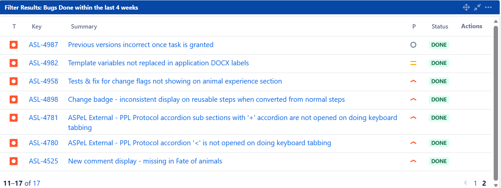

# Summary as of Wednesday 11th March 2026

## Future research and recruitment 

Thank you for your continued involvement in user research for ASPeL– your participation is integral to understanding the user experience. The research on ASPeL features continues. Please contact ASPELTechnicalQueries@homeoffice.gov.uk to participate. Thank you.  
 
# Completed Sprint 166 (uakari)

Attribution:

Interesting facts about uakaris:They are small, quiet, intelligent and active animals.

# Sprint Completion(A total of 7 issues were completed out of 33 issues listed this Sprint, tasks, and bugs were completed during this sprint, with priority given to bug fixes.)
1) Seven Tech Debt tickets, including a bug, related to-the Amazon Website Service(AWS) upgrade were completed during this Sprint
2) ASPeL outage between 24th and 25th of March was resolved partly by fixing issues within the AWS upgrade.
3) Comments on reusable steps added prior to previous release not showing in UI were made visible.
4) We boosted memory for overnight Elasticsearch automated jobs to enhance performance.
   

  
   
 

	

# Bugs done or closed this Sprint

Our goals for Sprint 166(uakari):

1)Complete at least 3 of 6 CAT-E Pil improvement tickets on the board 
2.Complete all AWS Tech debt tickets currently on the board 
3.Complete a standard protocols content ticket to test with users, behind a feature flag 
4.Complete at least 1 named person improvement ticket on the board 
5.Implement elastic search to stabilise and improve ASPeL database searches.
6.Complete the accessibility ticket on the board to improve user experience on ASPeL 
7.Get ASRU to define a substantial amendment 
8.Design the UI to mark a PPL as substantially amended

## Things to bear in mind
Kindly let us know how we are doing in keeping you informed. We appreciate your feedback on the content of this report. Thank you.

