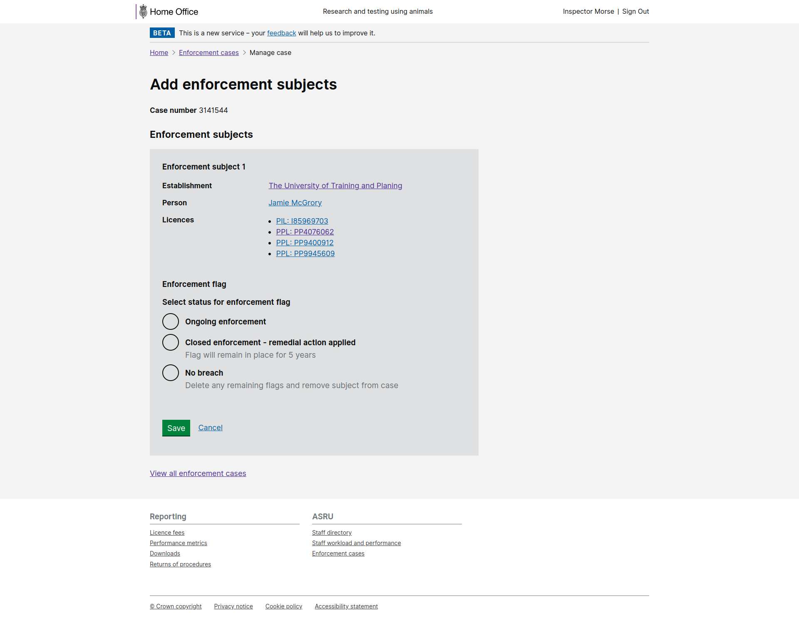
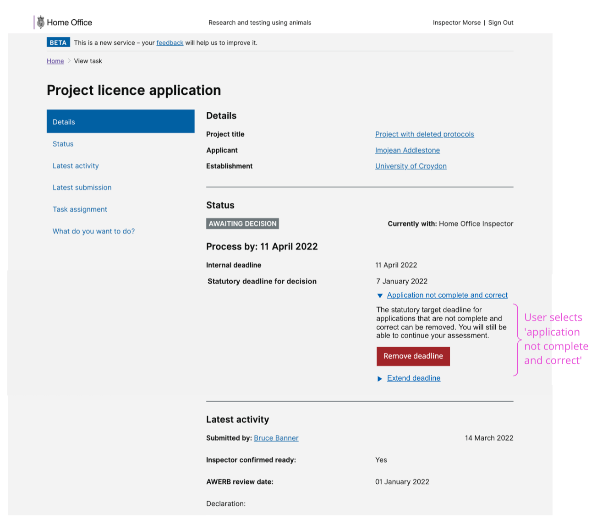

# Summary as of Wednesday 11 May 2022 

# Sprint 109

## Just Done
* TEXT_HERE
* TEXT_HERE
* TEXT_HERE

## About to Do/Doing
* TEXT_HERE
* TEXT_HERE
* TEXT_HERE

## Bugs Fixed this week
The following bugs were fixed this week.
[Bug Fixes week to Wednesday 11 May 2022](graphs/bugs11052022.png)

We planned the following issues in this sprint 
[Sprint 109](graphs/sprint11052022.png)

## Support tickets and known issues
[Link to Support Board](https://collaboration.homeoffice.gov.uk/jira/secure/RapidBoard.jspa?rapidView=1717&selectedIssue=ASSB-253)

[Support board - cached](graphs/supportBoard11052022.png)

## Click here for metrics / progress against plan
[Sprint 109](graphs/progress11052022.png)

[Post Release Roadmap](graphs/roadmap11052022.png)

1) Remodel complete and correct - working software 2) Prompt to ensure applicants don't already have a PIL - design

PREVIOUS_SPRINT_GOALS

## Sample Design Prototypes

 

 

## Google Analytics for this report
[Google Analytics](graphs/GA11052022.png)

