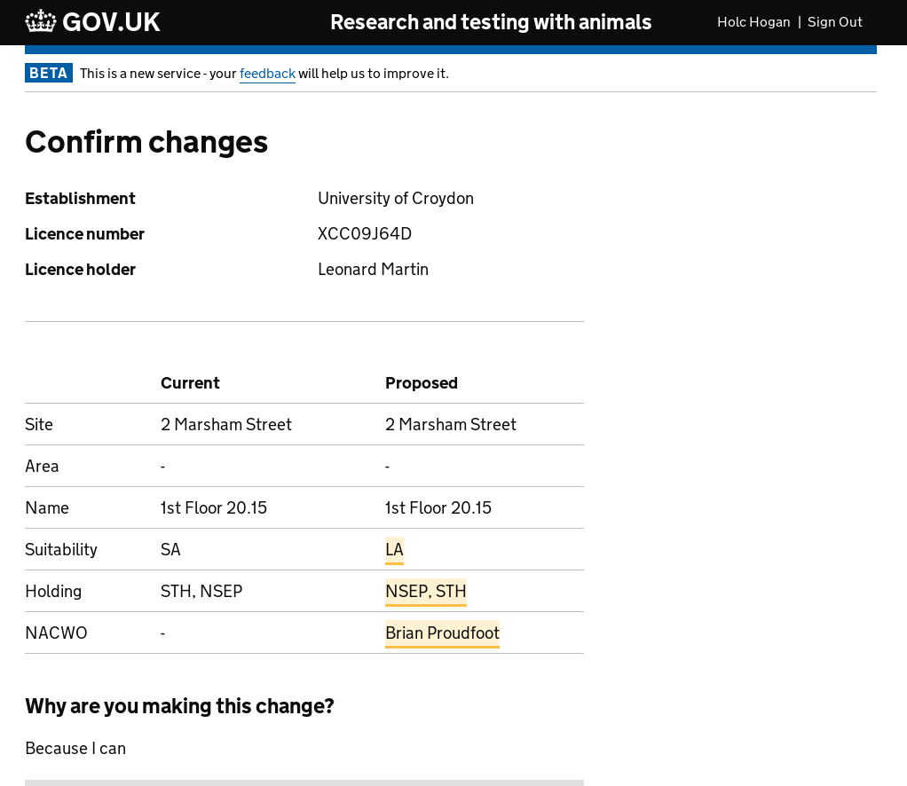
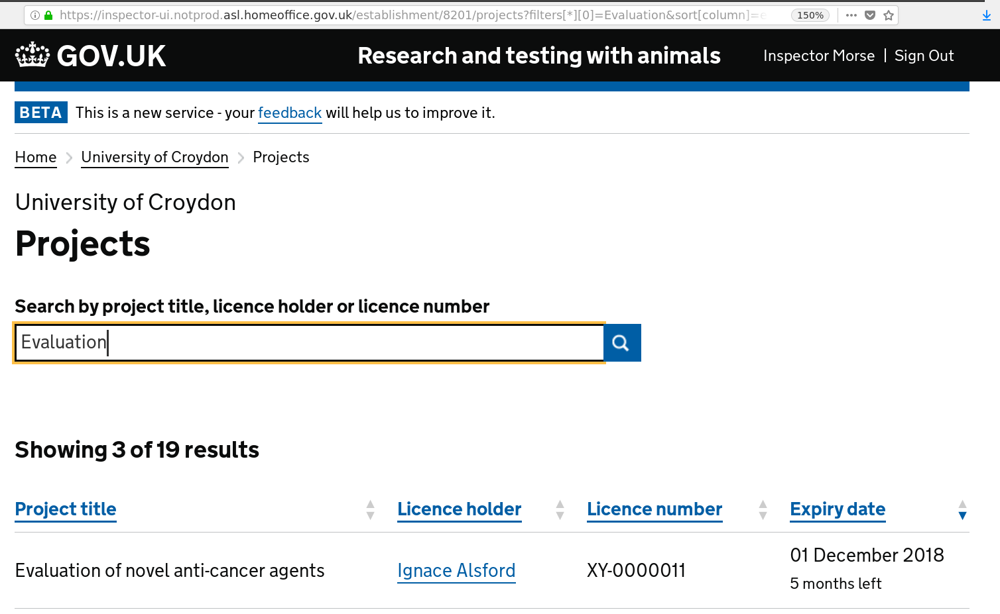

# Summary as of 11th July 2018 

# Sprint 12

## What's Blocking us / Issues
* Issue: ensuring that we continue to have contact with inspectors as we move into investigating PPLs
* Issue: ensuring that all the functionality required to turn off ASPeL can be delivered by August 2019

## Just Done
* Built and deployed services to write changes to approved areas into the licence database
* Processed outputs from the meeting of establishment users - gave initial report on findings at show and tell
* Iterated designs for establishment amendment journeys for inspectors based on findings from user research 

## About to Do/Doing
* Research PIL requirements with PIL applicants and NTCOs
* Design prototype of amendment journey with licensing team
* Deal with pagination of large data sets
* Build user and permission management tools

## Things to be aware of
* We are still waiting for security clearance for our the newest member of our team 

## Click here for our High-Level Road map
[Link to Live Road map in Trello](https://trello.com/b/gDQdE01u/asl-roadmap)    [\(Cached Image\)](graphs/ASLRoadMap11072018.jpg)

## Click here for metrics / progress against plan
[Week 1 - Sprint 12 - Release 1](graphs/progress11072018.png)

## Risks
[Links to Project Risks in Trello](https://trello.com/b/VuFuCL7t/risk-register-and-kpis-asl-delivery)    [\(Cached Image\)](graphs/ASLRiskRegister11072018.jpg)

[Risk Management Chart](graphs/risk11072018.png)

## Sprint Planning
* We planned the following issues in sprint planning today
[Link to Issues in Jira](https://jira.digital.homeoffice.gov.uk/secure/RapidBoard.jspa?rapidView=261)    [\(Cached Image\)](graphs/sprint11072018.png)

Our goals for the sprint are:
* Do PIL Research
* Understand how we might drive better processing and decision making for licensing 
* Demonstrate pagination

## Sample Design Prototype
Below are links to the prototype that we demonstrated at the show and tell yesterday.

Username: holc

Password: holc

Username: inspector

Password: inspector

