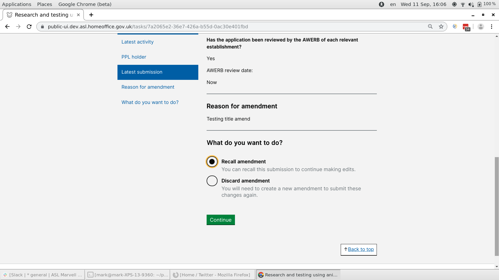
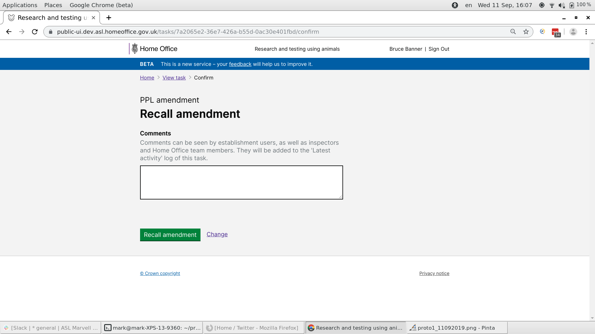

# Summary as of 11th September 2019 

# Sprint 41

## Just Done
* Recall and edit tasks
* Tables in Word exports

## About to Do/Doing
* PIL pdf download - working software
* Migration of PPL drafts
* Performance analysis and optimisation
* Design for Category E PILs

## Things to be aware of
* Members of the team attended a service assessment on Thursday 5th September

## Bugs Fixed this week

[Bug Fixes to week ending 11th September 2019](graphs/bugs11092019.jpg)

## Support tickets and known issues
[Link to Support Board](https://jira.digital.homeoffice.gov.uk/secure/RapidBoard.jspa?rapidView=331&selectedIssue=ALS-47)

[Support Board Status - cached](graphs/supportBoard11092019.jpg)

## Click here for metrics / progress against plan
[Week 2 - Sprint 41 - Release 1](graphs/progress11092019.png)

[We planned these issues in this sprint](graphs/sprint11092019.png)

## Our goals for the sprint are:
1. Migrate draft PPL amendments 
2. Deliver print view of PEL & PIL 
3. Service assessment

## Sample Design Prototypes

 

 

## Google Analytics for this report
[Google Analytics](graphs/GA11092019.jpg)

