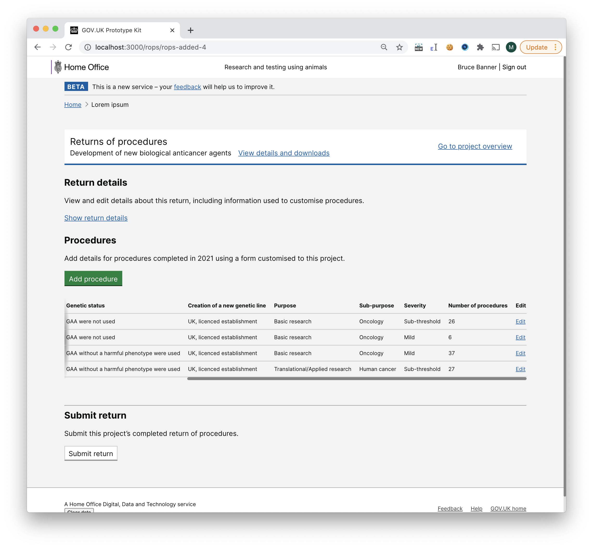

# Summary as of Wednesday 11 November 2020 

# Sprint 71  

## Just Done
* Content for first prototype allowing users' to submit their return of procedures in ASPeL - content design
* Digital view of NTS - working software
* Ability to view PPLs held elsewhere with additional availability at my establishment - working software
* Ability to query PPL database by species - working software

## About to Do/Doing
* Refining RoPs content following feedback - design and content design
* Testing of additional availability functionality pre-release - working software
* Rebuild of project home page - working software
* Move “confirm email” functionality from keycloak into ASPeL - working software

## Bugs Fixed this week
The following bugs were fixed this week.
[Bug Fixes week to Wednesday 11 November 2020](graphs/bugs11112020.png)

We planned the following issues in this sprint 
[Sprint 71](graphs/sprint11112020.png)

## Support tickets and known issues
[Link to Support Board](https://collaboration.homeoffice.gov.uk/jira/secure/RapidBoard.jspa?rapidView=1717&selectedIssue=ASSB-253)

[Support board - cached](graphs/supportBoard11112020.png)

## Click here for metrics / progress against plan
[Sprint 71](graphs/progress11112020.png)

[Post Release Roadmap](graphs/roadmap11112020.png)

## The goals for the current sprint (Donkey) are:
1. Complete research on Returns of Procedures Prototype - user research 
2. Managing Returns of Procedures Submissions - design 
3. Email verification - working software

## The goals for the previous sprint (Coconut) were:
1. Prepare for testing the "Returns of Procedures" prototype and high-level user journey - research and design ***[Done]***
2. Additional availability release candidate - development ***[Done]***

## Sample Design Prototypes

 

## Google Analytics for this report
[Google Analytics](graphs/GA11112020.png)
