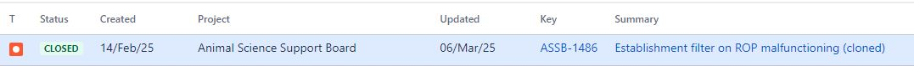

# Summary as of Wednesday 12th March 2025

## Future research and recruitment 

Thank you for your continued involvement in user research for ASPeL– your participation is integral to understanding the user experience. The research on ASPeL features continues. Please contact our user researcher David.utley@digital.homeoffice.gov.uk to participate. Thank you.  
 
# Sprint: 154(Ibex)

Attribution:

# Completed this Sprint

1) We continued improvements to the Named Person role nominations for establishments by implementing the Before you nominate page 
2) We provided Licensing data description for ASRU annual report
3) We enabled active licence data downloads on any specific date for users seeking licencing data
4) We deployed a fix for a bug where the User name and sign out/in link in header were squashed instead of being linear

# Bugs Done or Closed this Sprint

 

# New Sprint 155 (Jerboa)

Attribution:

# Planned for this Sprint 155 (Jerboa)
WE will;

1) Continue work on all outstanding change highlighting issues as a very high priority
2) Complete work on mandatory Named Persons' nominations page work
3) Complete User Research for Standard Protocols to progress the work on improvements for users
4) Complete the task to exclude ROP data from displaying as outstanding when the PPL holder has left an establishment.
5) Provide guidance and prompts throughout the Project Licence to guide establishments and PPL Holders to download a due RoP before transferring a PPL to another establishment 
   
   

   

## Things to bear in mind
Kindly let us know how we are doing in keeping you informed. We appreciate your feedback on the content of this report. 

# Work in progress
1) All outstanding change highlighting errors within ASPeL such as 'changed flag displayed when no change has been made', or flag not showing when comments have been added and all outstanding ROP related issues recently logged with us are continuing to be worked on as a high priority. We will update you as soon as resolved. 
  

   
 
   
## Support tickets and known issues
[Link to Support Board](https://collaboration.homeoffice.gov.uk/jira/secure/RapidBoard.jspa?rapidView=1717))

  

