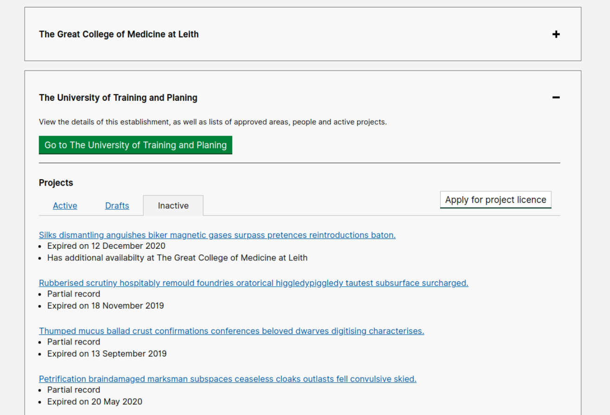

# Summary as of Wednesday 12 May 2021 

# Sprint 84 (Quokka)

## Weekly summary 
Assignment of tasks by members of ASRU has gone live. The design team rejoin the team from this sprint.

## Just Done
* Allow ASRU users to assign tasks (working software)
* Add search to establishments table in RoP outputs (working software)
* Add project protocol report (working software)
* Show expired and revoked projects on a user’s profile (working software)
* Include RoP submission tasks in “Project” related task filter in completed task lists (working software)

## About to Do/Doing
* Support use of reusable components for steps and protocols - user research
* Recruit inspectors to test reject/refuse PPL user journey - user research 
* Create RoPs document containing Qs and guidance - content design
* Refuse a PPL - design
* Reviewing task assignment and improvements to RoPs - design
* Add calls to action for RA submission (working software)
* Improvements to task assignment functionality (working software)
* Fix commenting on training questions in PPL applications/amendments (working software)

## Bugs Fixed this week
The following bugs were fixed this week.
[Bug Fixes week to Wednesday 12 May 2021](graphs/bugs12052021.png)

We planned the following issues in this sprint 
[Sprint 84](graphs/sprint12052021.png)

## Support tickets and known issues
[Link to Support Board](https://collaboration.homeoffice.gov.uk/jira/secure/RapidBoard.jspa?rapidView=1717&selectedIssue=ASSB-253)

[Support board - cached](graphs/supportBoard12052021.png)

## Click here for metrics / progress against plan
[Sprint 84](graphs/progress12052021.png)

[Post Release Roadmap](graphs/roadmap12052021.png)

## Goals for current sprint (quokka)
1. Plan and prepare testing for "Refuse a PPL" - design and user research 
2. Improve messaging around RA requirements - working software

## Goal for previous sprint (pterodactyl)
Initial release of changes to ASRU workflow (assignment of tasks) ***[Done]***

## Screenshots of recently released software 
### Show expired and revoked projects on a user’s profile

 

## Google Analytics for this report
[Google Analytics](graphs/GA12052021.png)

