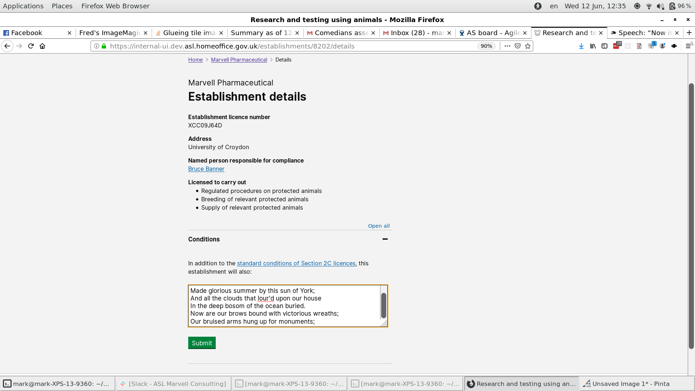
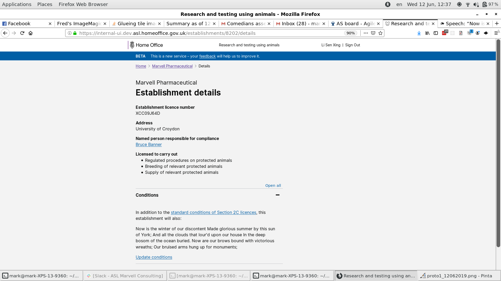

# Summary as of 12th June 2019 

## Just Done
* RRRTEXT_FILL

## About to Do/Doing
* RRRTEXT_FILL

## Things to be aware of
* We have received a report on the IT Health check, we are addressing the issues identified

## Click here for Prioritised Road Map
[\(Prioritised Road Map\)](graphs/ASLRoadMap12062019.jpg)

## Click here for metrics / progress against plan
[Week 1 - Sprint 35 - Release 1](graphs/progress12062019.png)

## Burnup Chart

[Burnup Chart](burnup12062019.md)

## Risks
[Links to Project Risks in Trello](https://trello.com/b/VuFuCL7t/risk-register-and-kpis-asl-delivery) 
[Link to Risk Chart](graphs/risk12062019.png)

## Sprint Planning
* We planned the following issues in sprint planning today [Link to Issues in Jira](https://jira.digital.homeoffice.gov.uk/secure/RapidBoard.jspa?rapidView=261)    [\(Cached Image\)](graphs/sprint12062019.png)

### Our goals for the previous sprint were:
1. Halloween data testing ***[Done]*** 
2. End to end test ASRU/Establishments ***[In progress]*** 
3. Dev Conditions for PILs and PELs ***[Done]*** 
4. PEL Details amendments design ***[Done]*** 
5. Design views of granted PPLs (including legacy)***[Ongoing]***

### Our goals for the sprint are:
1. Amend PPL holder - dev 
2. Amend establishment details - dev 
3. Plan and conduct ASRU roadshow 
4. Design views of granted PPL licences (digital, print, new, legacy)

## Screenshots of the PPL application prototype

 

 

## Google Analytics for this report
[Google Analytics](graphs/GA12062019.jpg)

