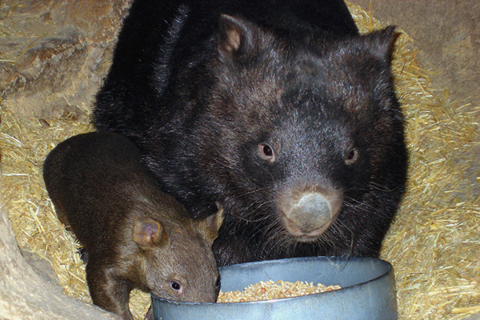
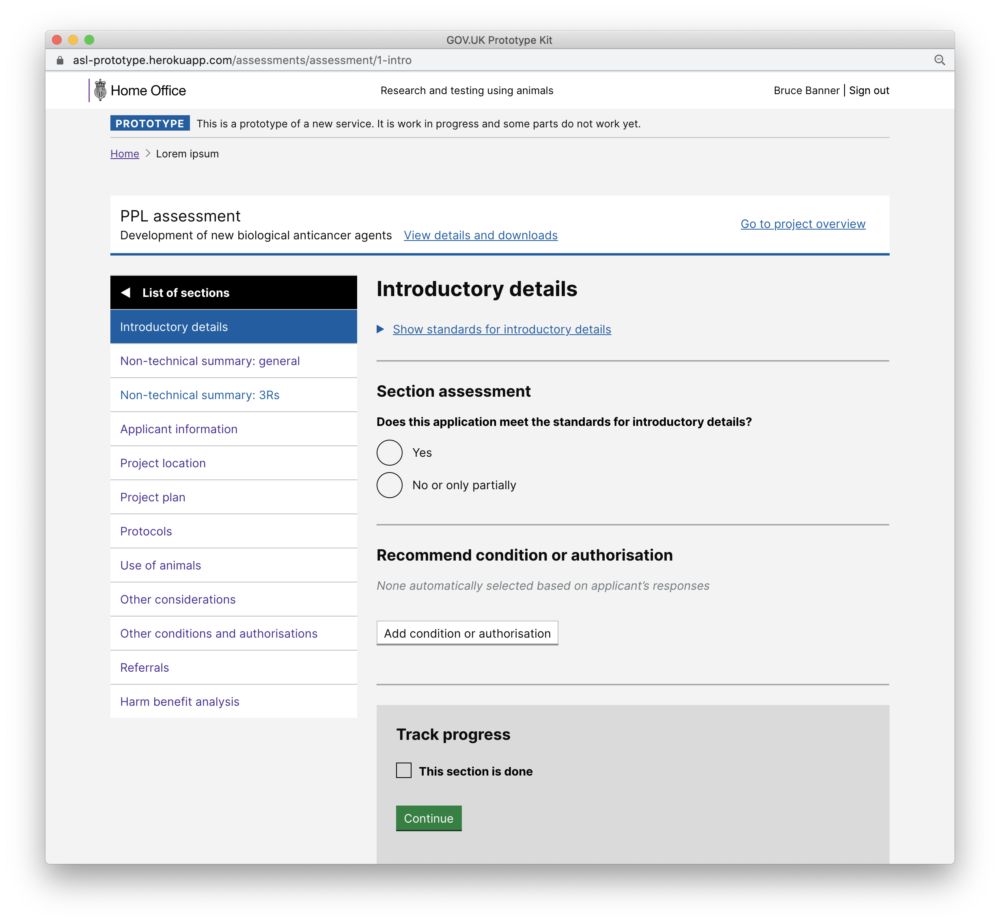

# Summary as of Thursday 12 August 2021 

# Sprint 90 (Wombat)

## Weekly summary

## Just Done
* Design review of the ROPs submission process in ASPEL to check designs are correct and make small refinements to page layouts
* Designing content for the downloads section of the PPL overview to make it easier for ASRU and establishments to see historical versions of licences and applications
* Allow establishment admins to download a list of submitted ROPs (hidden until release agreement)
* Fixed issue with ROPs species selector displaying duplicate species
* Allow multiple “other” ROPs subpurposes to be added

## About to Do/Doing
* Design review of ROPs reviewing process (for ASRU) and the data dashboards (for stats team) to check all designs are correct
* Clearing search results on advanced project search - design
* Minor improvements to PPL assessments - design
* Removing references to SPOC in ASRU to reflect the new process - design
* Updating ASRU role descriptions in ASPEL to reflect the new process - design
* Improving the links to the application / licence views - working software

We planned the following issues in this sprint 
[Sprint 90](graphs/sprint12082021.png)

## Support tickets and known issues
[Support board - cached](graphs/supportBoard12082021.png)

## Click here for metrics / progress against plan
[Sprint 90](graphs/progress12082021.png)

### We set these goals for this sprint (Wombat)
1. Makes ROPs ready for deployment - working software 
2. Prepare for technical design authority - whole team 
3. Filtering inspectors' tasks - design

## Sample Design Prototypes

 

## Google Analytics for this report
[Google Analytics](graphs/GA12082021.png)

