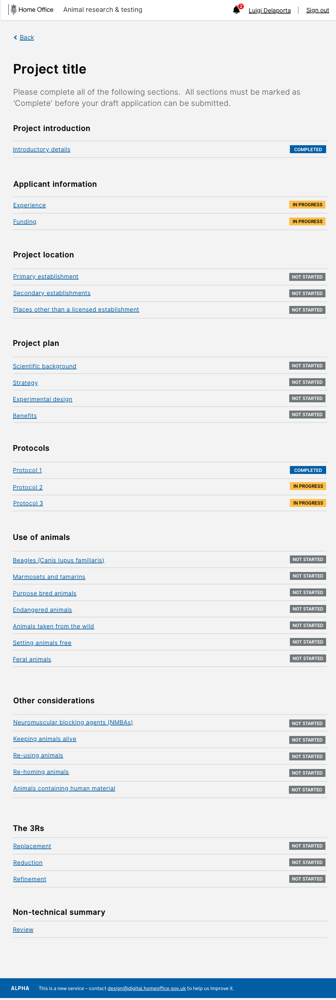

# Summary as of 12th December 2018 

## Just Done
* Setting permissions for external users
* Addressing issues arising from new users using the "University of Croydon test environment"
* Played back finding from LASA conference

## About to Do/Doing
* Start the CSOC onboarding process
* Explore PPL Application Types / Routing
* Produce Sketch for protocols and Species
* ASRU (internal user permissions) - working software 

## Things to be aware of
* The road map has been replaced by a prioritised roadmap (see links and links to cached page)

## Click here for Prioritised Road Map
[Prioritised Road Map](https://trello.com/b/p7x9hbPV/prioritised-roadmap)    [\(Cached Image\)](graphs/ASLRoadMap12122018.jpg)

## Click here for metrics / progress against plan
[Week 1 - Sprint 23 - Release 1](graphs/progress12122018.png)

## Burnup Chart

[Burnup Chart](burnup12122018.md)

## Risks
[Links to Project Risks in Trello](https://trello.com/b/VuFuCL7t/risk-register-and-kpis-asl-delivery)    [\(Cached Image\)](graphs/ASLRiskRegister12122018.jpg)

[Risk Management Chart](graphs/risk12122018.png)

## Sprint Planning
* We planned the following issues in sprint planning today [Link to Issues in Jira](https://jira.digital.homeoffice.gov.uk/secure/RapidBoard.jspa?rapidView=261)    [\(Cached Image\)](graphs/sprint12122018.png)

### Our goals for the previous sprint were:
1. Content Design - Full PPL Research Application [Met]
2. UR - Playback findings from LASA and ASRU [Met]
3. Build PPL Prototype [Met]

Our goals for the sprint are:
1. Advanced user input in PPL prototype 
2. User feedback on new sections of PPL form 
3. Iterate protocols for PPL 4) Explore PPL Application types/routing

## "University of Croydon" Test Environment 

### Screenshots

 
 

### Need a test account?
If you need a test account please contact [animalscience@digital.homeoffice.gov.uk](mailto://animalscience@digital.homeoffice.gov.uk)

