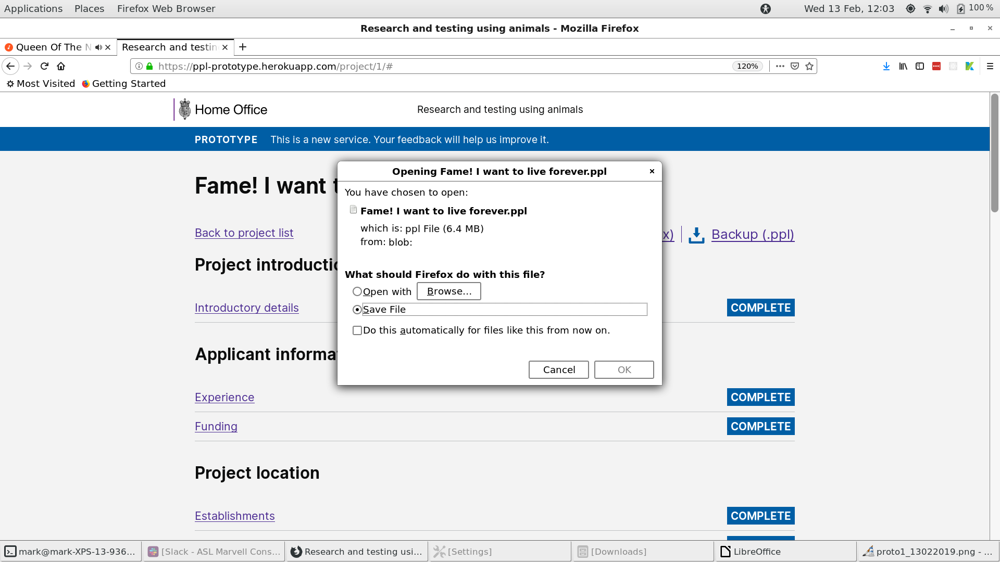
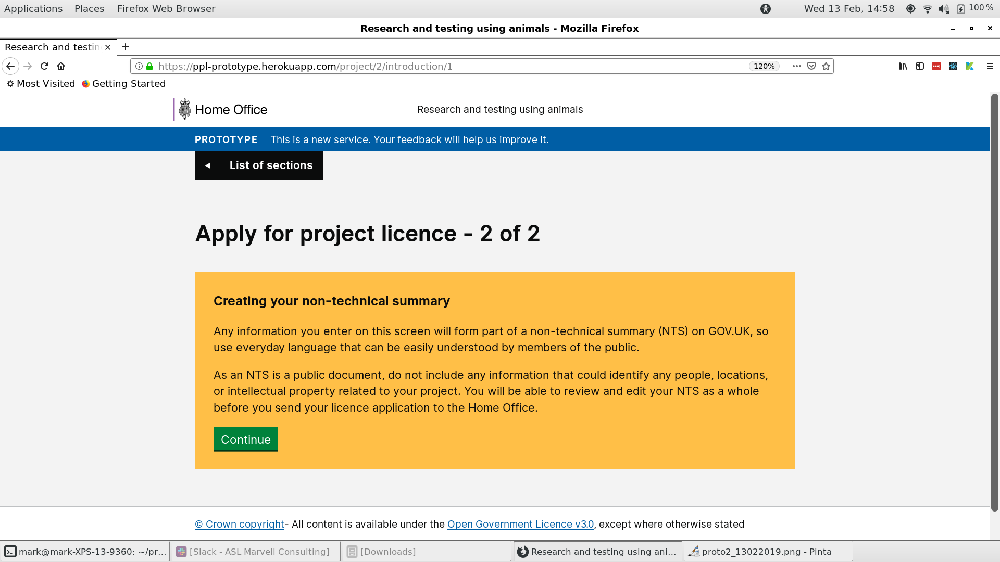

# Summary as of 13th February 2019 
## Just Done
* Conducted research on PPL application review with inspectors and establishment users
* Delivered working software - PPL Applications drafting tool for release

## About to Do/Doing
* Continuing research on PPL application review with inspectors and establishment users
* Preparation for final Alpha service assessment
* Drafting privacy notice
* Integrating PPL with database
* Internet Explorer security

## Things to be aware of
* The PPL Application drafting tool will be made available to establishment users today
* The final Alpha service assessment is next Wednesday
* We will be freezing changes to the PPL drafting tool except for fixing critical errors in the next sprint
 
## Click here for Prioritised Road Map
[Prioritised Road Map](https://trello.com/b/p7x9hbPV/prioritised-roadmap)    [\(Cached Image\)](graphs/ASLRoadMap13022019.jpg)

## Click here for metrics / progress against plan
[Week 2- Sprint 26 - Release 1](graphs/progress13022019.png)

## Burnup Chart

[Burnup Chart](burnup13022019.md)

## Risks
[Links to Project Risks in Trello](https://trello.com/b/VuFuCL7t/risk-register-and-kpis-asl-delivery) 

[Risk Management Chart](graphs/risk13022019.png)

## Sprint Planning
* We planned the following issues in sprint planning today [Link to Issues in Jira](https://jira.digital.homeoffice.gov.uk/secure/RapidBoard.jspa?rapidView=261)    [\(Cached Image\)](graphs/sprint13022019.png)

Our goals for the sprint are:
1. Carry out PPL review research with inspectors and establishment users
2. Prepare for service assessment
3. Release PPL drafting tool to establishments
4. Get ASRU users to log into the system

## Screenshots of the PPL application prototype

 

 

## Google Analytics for this report

This shows:
* total number of users
* number of new users

[Google Analytics](graphs/GA13022019.jpg)

