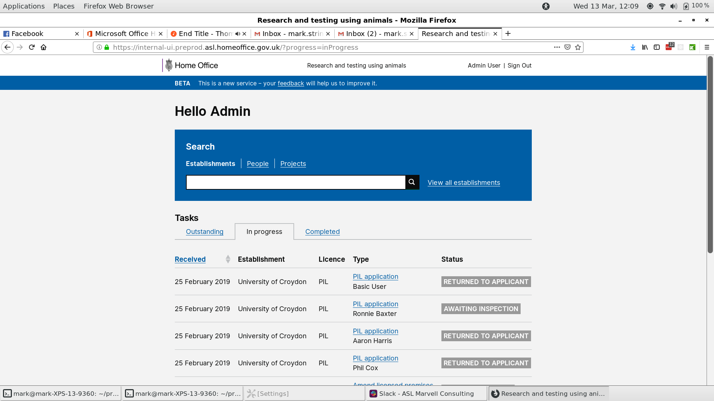
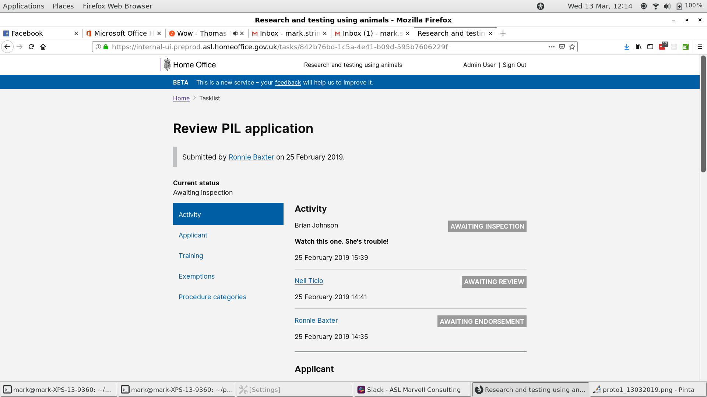

# Summary as of 13th March 2019 

## Just Done
* Tested working software with licensing officers
* Notification by email - first working software
* Data migration

## About to Do/Doing
* Planning research with establishments to explore the view of the granted licence
* Activity log pages 
* Commenting and feedback
* Continuing with data migration

## Things to be aware of
* A risk workshop has been arranged with security assurance colleagues
 
## Click here for Prioritised Road Map
[Prioritised Road Map](https://trello.com/b/p7x9hbPV/prioritised-roadmap)    [\(Cached Image\)](graphs/ASLRoadMap13032019.jpg)

## Click here for metrics / progress against plan
[Week 2 - Sprint 28 - Release 1](graphs/progress13032019.png)

## Burnup Chart

[Burnup Chart](burnup13032019.md)

## Risks
[Links to Project Risks in Trello](https://trello.com/b/VuFuCL7t/risk-register-and-kpis-asl-delivery) 
[Link to Risk Chart](graphs/risk13032019.png)

## Sprint Planning
* We planned the following issues in sprint planning today [Link to Issues in Jira](https://jira.digital.homeoffice.gov.uk/secure/RapidBoard.jspa?rapidView=261)    [\(Cached Image\)](graphs/sprint13032019.png)

Our goals for the sprint are:
1. Data Migration
2. Legacy PPLs Skeleton Design 
3. Granting PPLs - design 
4. Split PPL Review into separate Chunks  
5. Licensing Officer - test working software 
6. Plan research view of licence

## Screenshots of the PPL application prototype

 

 

## Google Analytics for this report

This shows:
* total number of users
* number of new users

[Google Analytics](graphs/GA13032019.jpg)

