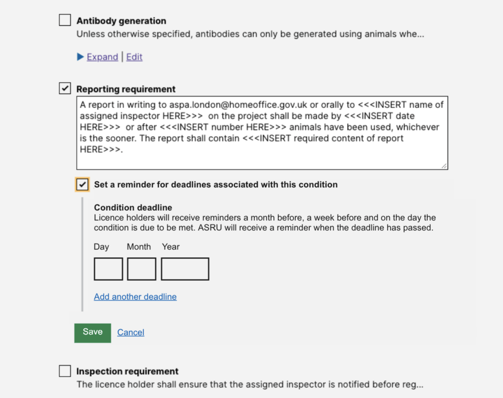

# Summary as of Wednesday 13 April 2022 

# Sprint 107 (Nightingale)

## Just Done
* designs for adding in-system deadlines and notifications to conditions with time based requirements 
* TEXT_HERE
* TEXT_HERE

## About to Do/Doing
* reviewing potential improvements into Protocols, initial exploration into suspending licences - design
* TEXT_HERE
* TEXT_HERE

We planned the following issues in this sprint 
[Sprint 107](graphs/sprint13042022.png)

## Support tickets and known issues
[Link to Support Board](https://collaboration.homeoffice.gov.uk/jira/secure/RapidBoard.jspa?rapidView=1717&selectedIssue=ASSB-253)

[Support board - cached](graphs/supportBoard13042022.png)

## Click here for metrics / progress against plan
[Sprint 107](graphs/progress13042022.png)

[Post Release Roadmap](graphs/roadmap13042022.png)

### The areas of focus for this sprint are:
1. Start to understand requirements for service handover - product management
2. Enforcement flags release candidate - working software 
3. Initial exploration - suspend a PPL - design

### The areas of focus for the previous sprint were:
1. New declarations for PPLs ***[Done]***
2. Enforcement Flags - development ***[Ongoing]*** 3) Time-based conditions - design ***[Done]***

## Sample Design Prototypes

 

## Google Analytics for this report
[Google Analytics](graphs/GA13042022.png)

