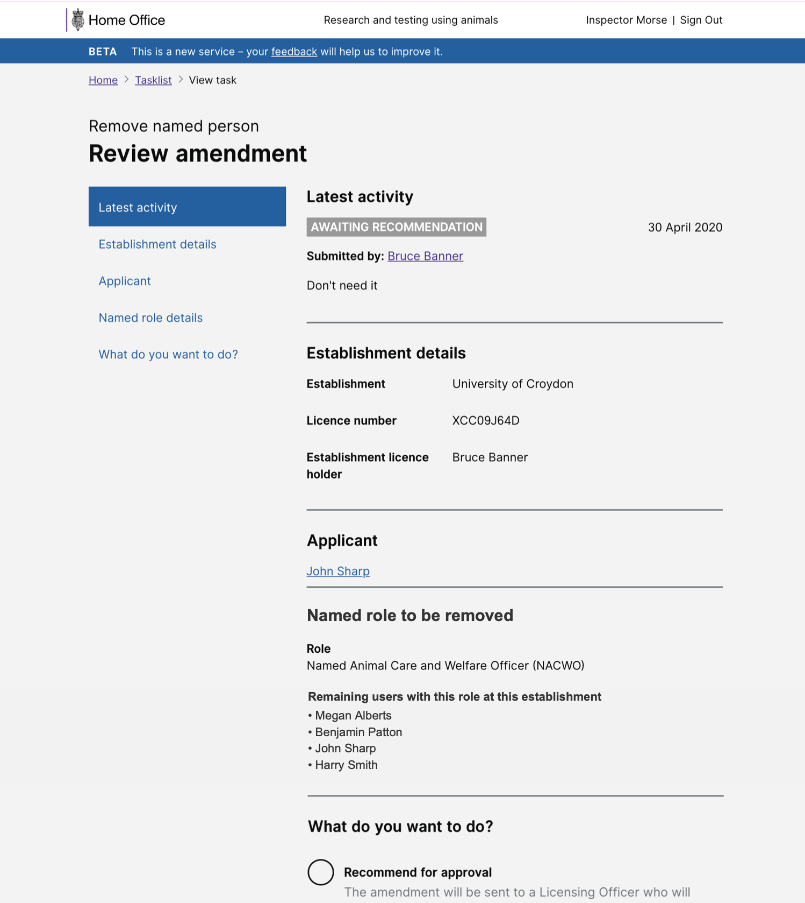

# Summary as of Wednesday 13 May 2020 

# Sprint 58

## Just Done
* Added support for multiple NACWO assignments to approved areas - working software
* Table of adverse effects PDF download - working software
* Protocol summary table online view - working software
* Showing remaining users in a role on a remove named role task - design
* Iteration of training and exemptions improvements - design
* Iteration of Cat E PIL - design
* Completed PIL E user research

## About to Do/Doing
* Allow assignment of NVSs to approved areas - working software
* PPL application PDF download - working software
* Further iteration of Category E PIL designs based on research findings
* Arrange and complete training profile user research

## Bugs Fixed this week
The following bugs were fixed this week.
[Bug Fixes week to Wednesday 13 May 2020](graphs/bugs13052020.png)

We planned the following issues in this sprint 
[Sprint 58](graphs/sprint13052020.png)

## Support tickets and known issues
[Link to Support Board](https://collaboration.homeoffice.gov.uk/jira/secure/RapidBoard.jspa?rapidView=1717&selectedIssue=ASSB-253)

[Support board - cached](graphs/supportBoard13052020.png)

## Click here for metrics / progress against plan
[Sprint 58](graphs/progress13052020.png)

[Post Release Roadmap](graphs/roadmap13052020.png)

Our goals for the previous sprint were:
1. Multiple people on SOP ***[In progress]***
2. Design Adding training modules to people’s profiles ***[Done]***
3. User Research complete PIL E research ***[Done]***

Our goals for the current sprint are:
1. Conduct training profile user research 
2. Design - Cat E applications for existing PIL holders 
3. Development - PPL application download as pdf

## Sample Design Prototypes
### Showing remaining users in a role on a remove named role task

 

## Google Analytics for this report
[Google Analytics](graphs/GA13052020.png)

