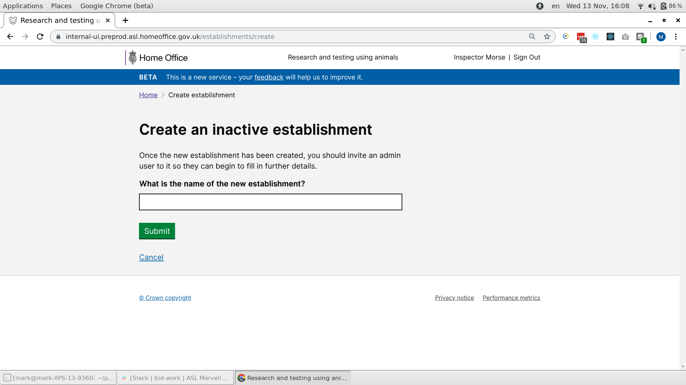
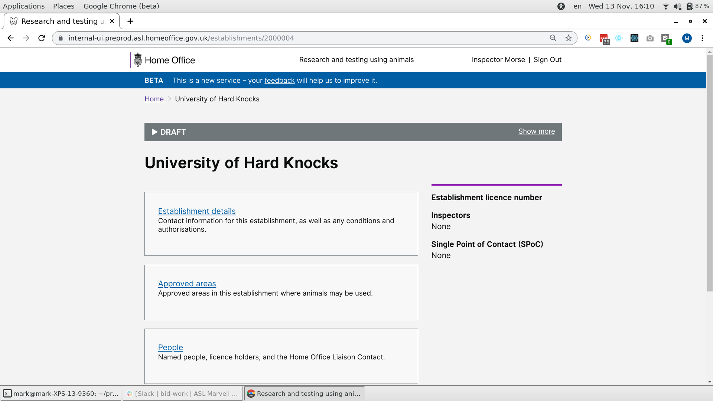

# Summary as of Wednesday 13 November 2019 

# Sprint 46

## Just Done
* PIL Animal types selector refactor 
* Add new establishment, working software
* Billing research with ASRU Business support
* Billing research with Establishments 
* Arranged to attend AWERB meetings
* Holistic review of notifications for non-ASRU users

## About to Do/Doing
* Design - show ASRU and establishments a list of the active PIL in a financial year
* Working software - Apply for and grant PEL
* User rearch of AWERB for lay people
* Working software - ASRU amends establishment details

## Bugs Fixed this week
The following bugs were fixed this week.
[Bug Fixes week to Wednesday 13 November 2019](graphs/bugs13112019.png)

We planned the following issues in this sprint 
[Sprint 46](graphs/sprint13112019.png)

## Support tickets and known issues
[Link to Support Board](https://jira.digital.homeoffice.gov.uk/secure/RapidBoard.jspa?rapidView=331&selectedIssue=ALS-47)

[Support board - cached](graphs/supportBoard13112019.jpg)

## Click here for metrics / progress against plan
[Sprint 46](graphs/progress13112019.png)

[Post Release Roadmap](graphs/roadmap13112019.png)

Our goals previous sprint were:
1. 5 year PIL review design ***[In progress]***
2. New PPL optimisation - working software ***[Done]***
3. Organise UR for establishment billing ***[Done]***

Our goals for the next sprint are:
1. Design invoicing
2. Research AWERBS
3. Working software - transfer a PIL between establishments

## Sample Design Prototypes

 

 

## Google Analytics for this report
[Google Analytics](graphs/GA13112019.png)

