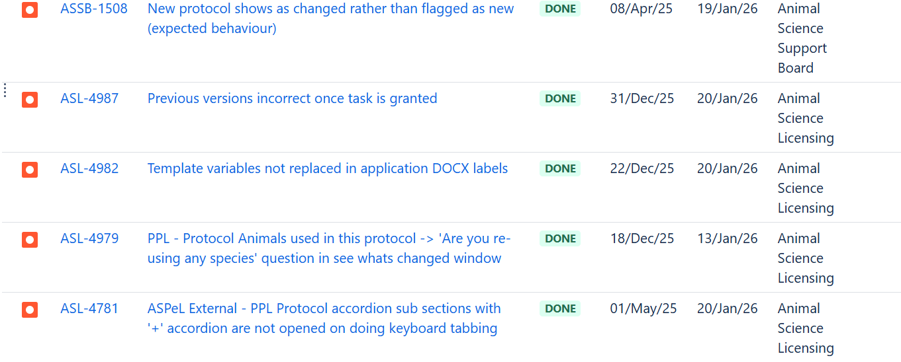
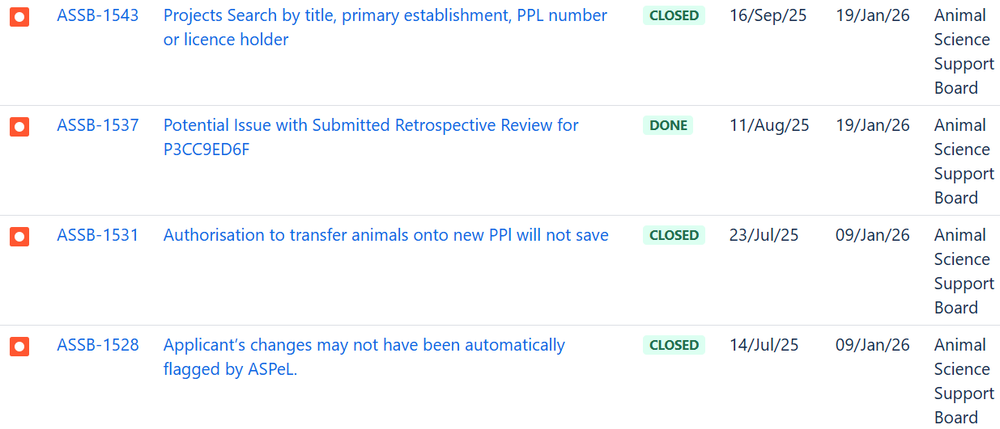
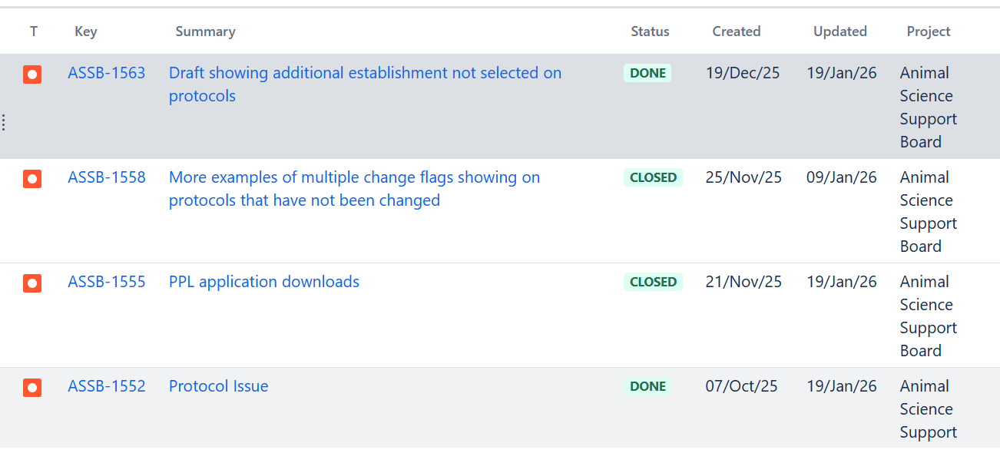

# Summary as of Wednesday 14th January 2026

## Future research and recruitment 

Thank you for your continued involvement in user research for ASPeL– your participation is integral to understanding the user experience. The research on ASPeL features continues. Please contact ASPELTechnicalQueries@homeoffice.gov.uk to participate. Thank you.  
 
# Sprint: 164(snow leopard)

Attribution:

Interesting facts about snow leopards:The first captive bred snow leopard cubs were born in the 1990s in the Beijing Zoo.

# This Sprint, 
	
1) Seven new pages of Cat E Pil improvement tickets have been completed, behind a feature flag.
2) Additionally, seven HBA replacement tickets were completed under the same feature flag.
3) The training records section was enhanced by introducing change flags, making it easier to see what modifications have occurred.
4) The comparison page, or 'see what's changed', now displays updates correctly when edits are made in the training files section.
5) The animal reuse option in the fate of animals section has been revised to help users understand their choices more clearly.

	

# Bugs done or closed this Sprint

 

# New Sprint 165 (tamarin)

Attribution:

Interesting facts about Tamarins: The adult males, subadults, and juveniles in the group assist with caring for the young, bringing them to their mother to nurse.

Planned for this Sprint:
1. Resolve remaining reported Change highlighting issues.
2. Resolve remaining reported Comment display issues.
3. Start Named Person work to update screens, based on the feedback during the first User Acceptance Testing.
4. Continue Amazon Web Services upgrade.
5. Continue Standard Protocols content work (for fixed SP4).
6. Build DOCX exporter for Non Technical Summary.
7. Continue Cat E PIL work.

## Things to bear in mind
Kindly let us know how we are doing in keeping you informed. We appreciate your feedback on the content of this report. Thank you.

