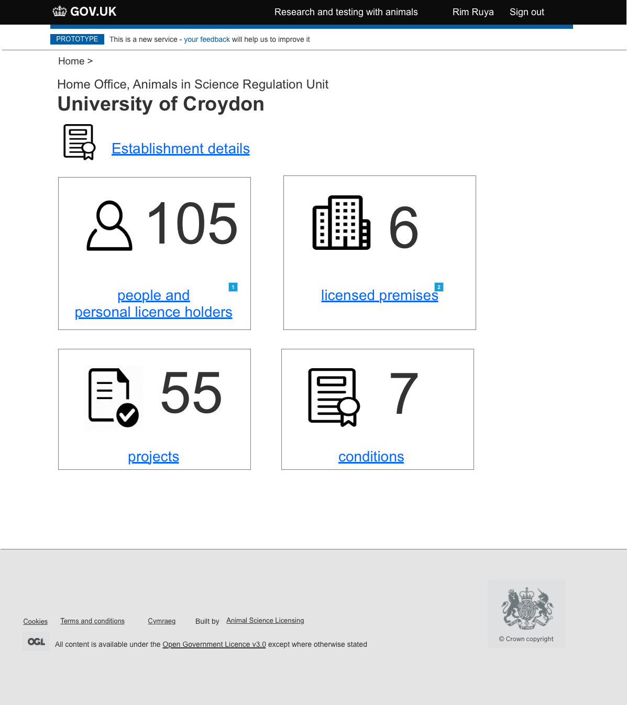
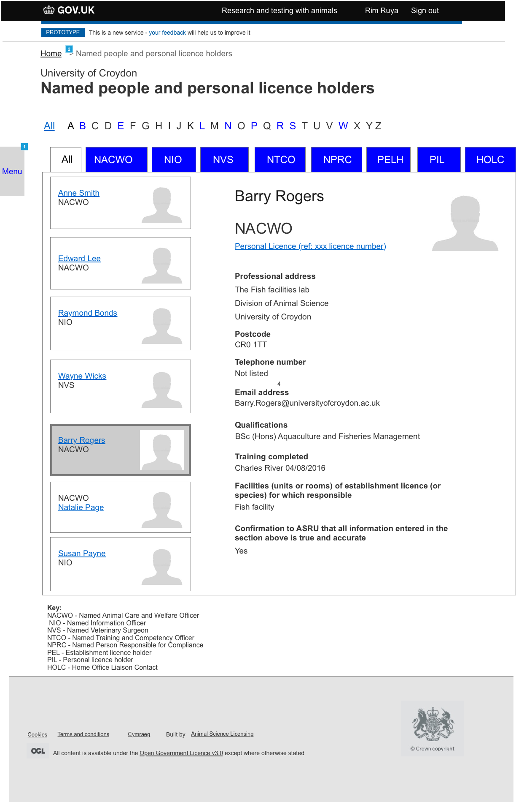
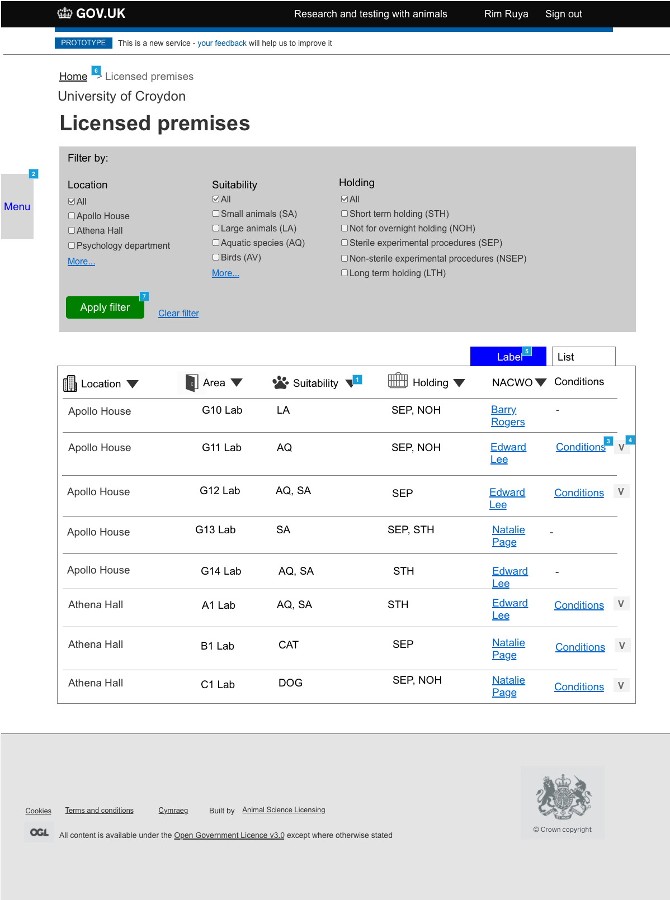

# Summary as of 14th March 2018
* Two members of the team are waiting for security clearance. This is still an impediment as it makes it difficult to access Lunar house.

## Just Done
* Members of the Marvell team attended the ASRU conference in central London
* At the conference members of the team reviewed design prototypes with inspectors
* Research trip to university establishments
* Pdf generation

## About to Do/Doing
* Further research trips to university establishments

## Things to be aware of
* Two members of the team attended a Home Office cross working system design meetup
* Two new people, a software developer and an interaction designer will join the team in the next sprint

## Click here for our High-Level Road map
[Link to Live Road map in Trello](https://trello.com/b/gDQdE01u/asl-roadmap)    [\(Cached Image\)](graphs/ASLRoadMap14032018.png)

## Click here for metrics / progress against plan
[Week 2 - Sprint 3 - Release 1](graphs/progress14032018.png)

## Risks
[Links to Project Risks in Trello](https://trello.com/b/VuFuCL7t/risk-register-and-kpis-asl-delivery)    [\(Cached Image\)](graphs/ASLRiskRegister14032018.png)

[Risk Management Chart](graphs/risk14032018.png)

## Sprint Planning
* We planned the following issues in sprint planning today [Link to Issues in Jira](https://jira.digital.homeoffice.gov.uk/secure/RapidBoard.jspa?rapidView=261)    [\(Cached Image\)](graphs/sprint14032018.png)
* Our two goals for the sprint are
	1. **"Explore Schedule of Premises"**
	2. **"Explore Offline Access"**

## Sample Design Prototypes
[HOLC Dashboard](graphs/dashboard_holc_icon.png)

[People List](graphs/people_list.png)

[Premises](graphs/premises.png)

