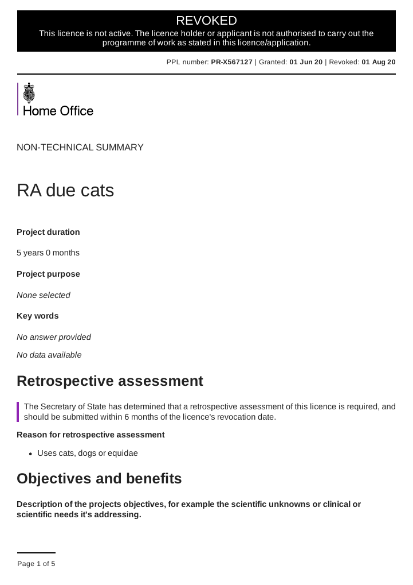

# Summary as of Wednesday 14 April 2021 

# Sprint 82 (Ocelot)

## Weekly Summary 
This week the developers have continued to build out the flesh around the RoPs submission skeleton, which is now working end-to-end. We remain on course to release the RoPs submission functionality within ASPeL this summer.
Work has also been ongoing to move the PPL expiry notifications, which have previously been sent by letters, into our email service. These notifications alert PPL holders to the upcoming expiration of their licences and tell then what necessary actions are required. We will be ready to release this change soon. 

## Just Done
* TEXT_HERE
* TEXT_HERE
* TEXT_HERE

## About to Do/Doing
* TEXT_HERE
* TEXT_HERE
* TEXT_HERE

## Bugs Fixed this week
The following bugs were fixed this week.
[Bug Fixes week to Wednesday 14 April 2021](graphs/bugs14042021.png)

We planned the following issues in this sprint 
[Sprint 82](graphs/sprint14042021.png)

## Support tickets and known issues
[Link to Support Board](https://collaboration.homeoffice.gov.uk/jira/secure/RapidBoard.jspa?rapidView=1717&selectedIssue=ASSB-253)

[Support board - cached](graphs/supportBoard14042021.png)

## Click here for metrics / progress against plan
[Sprint 82](graphs/progress14042021.png)

[Post Release Roadmap](graphs/roadmap14042021.png)

## Our goal for this sprint (Oceleot) is:
Send expiry notifications for PPLs

## Our goal for the previous sprint (Narwhal) was:
ROPs end-to-end journey - released to production ***[Done]***

## Sample Design Prototypes

 

## Google Analytics for this report
[Google Analytics](graphs/GA14042021.png)

