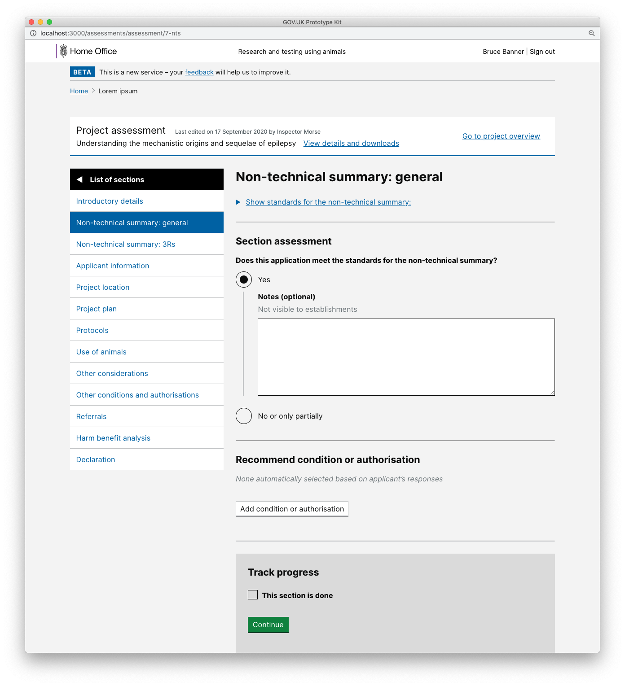
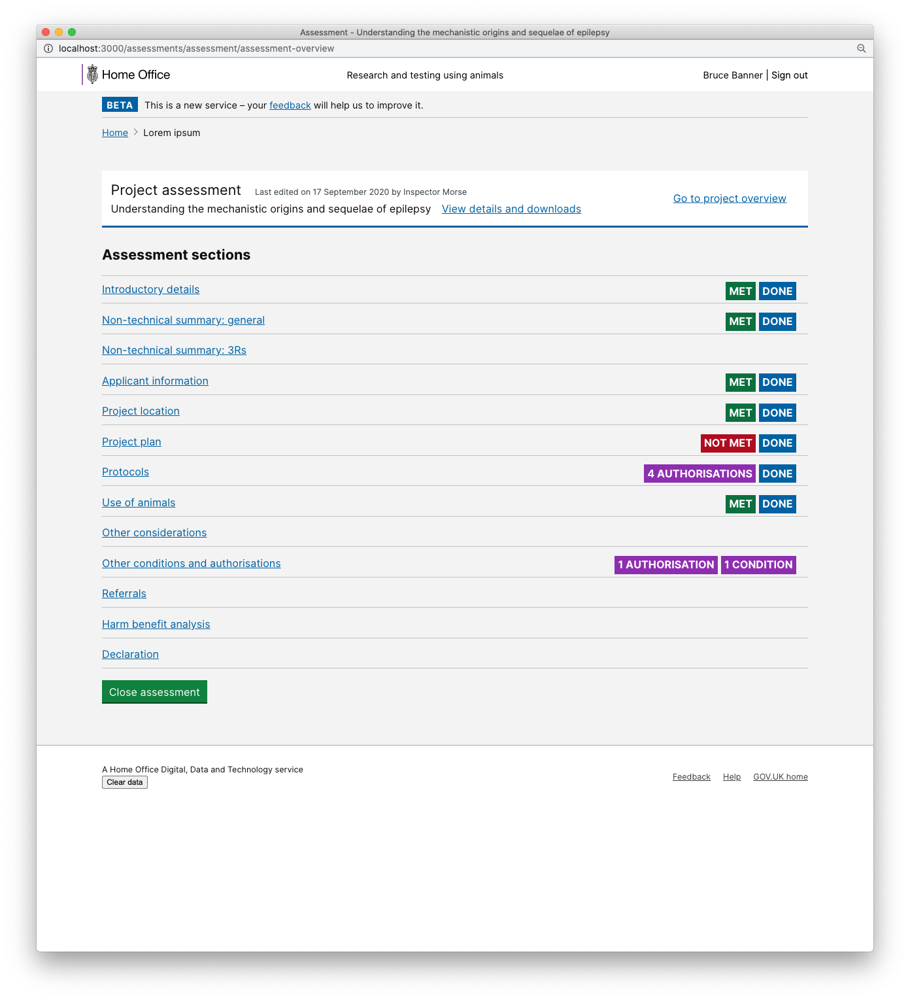

# Summary as of Wednesday 14 October 2020 

# Sprint 69 &#x1f966;

## Just Done
* Held 6 sessions with inspectors on assessing a PPL application and a PPL amendment - user research
* Summarised PPL assessment research findings - user research
* Scheduled a research session for the 6th of November with an establishment’s HOLC and PPL holder to test design concepts for the Returns of Procedures form - user research 
* User testing on PPL assessments for applications and amendments - design
* Initial designs for how we link to previously granted licences, applications, NTSs and assessment sheets - design
* Include Category E PILs in billing data - working software
* Add report to Category E PILs - working software
* Merge two defunct establishments into their parent establishment - working software
* Add intermediate confirmation screen to PIL applications - working software
* Release UI to add explanations to expired PPL statutory deadlines - working software

## About to Do/Doing
* Preparing to update our online consent form template to bring it in line with the new HO consent template and guidance - user research
* Iterating assessments, improving PPL version control - design
* Initial work on making PPLs visible to establishments with additional availability - working software
* Performance improvements to PPL statutory deadline reporting - working software
* Add named people and approved area links to PEL details pages - working software
* Improvements to training UI in PPL application reviews - working software

## Bugs Fixed this week
The following bugs were fixed this week.
[Bug Fixes week to Wednesday 14 October 2020](graphs/bugs14102020.png)

We planned the following issues in this sprint 
[Sprint 69](graphs/sprint14102020.png)

## Support tickets and known issues
[Link to Support Board](https://collaboration.homeoffice.gov.uk/jira/secure/RapidBoard.jspa?rapidView=1717&selectedIssue=ASSB-253)

[Support board - cached](graphs/supportBoard14102020.png)

## Click here for metrics / progress against plan
[Sprint 69](graphs/progress14102020.png)

[Post Release Roadmap](graphs/roadmap14102020.png)

### These are the goals for this sprint
1. Release category E PILs - working software
2. PPL version control - design and content 
3. Summary of findings for returns of procedures - user research

### This was the goal for the previous sprint
1. Test PPL assessments with inspectors - user research and design

## Sample Design Prototypes
### PPL assessment section

 
### Partially completed assessment

 

## Google Analytics for this report
[Google Analytics](graphs/GA14102020.png)

