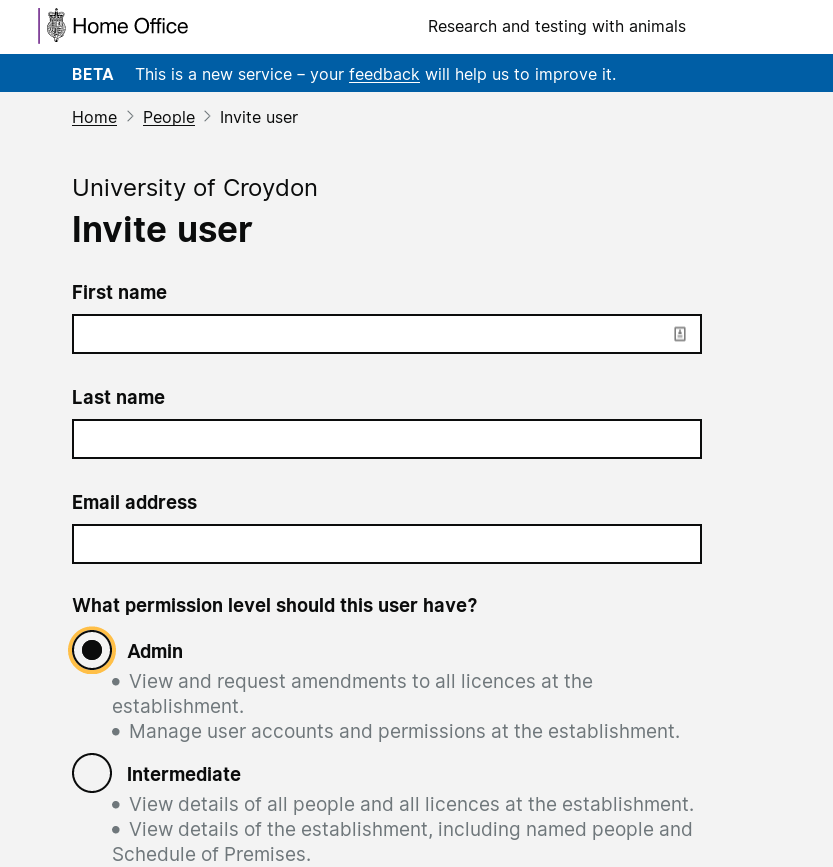
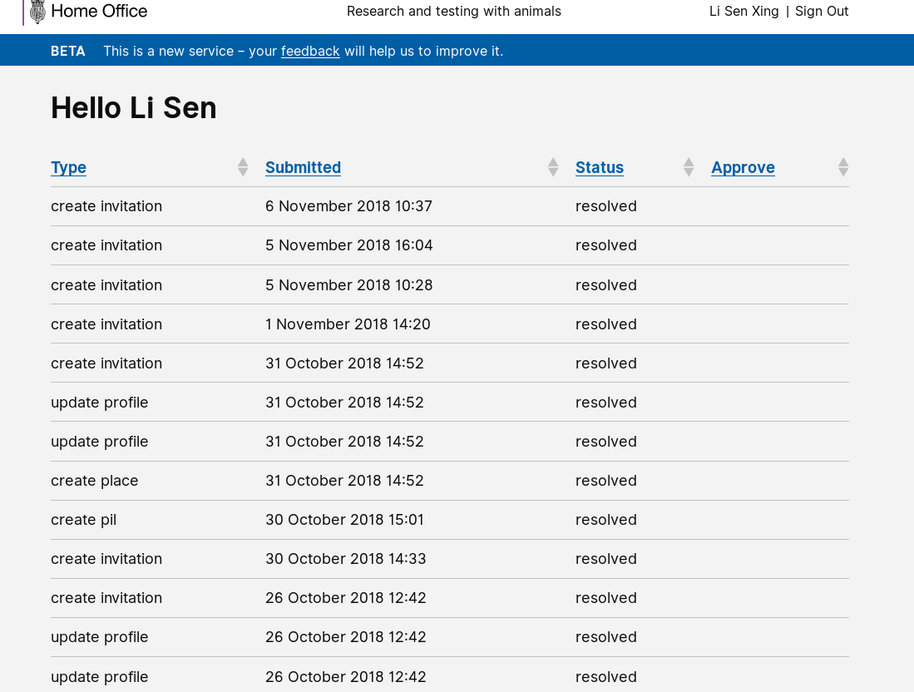

# Summary as of 14th November 2018 

# Sprint 21

## Just Done
* Refactored external user onboarding to make it easier for users to use pre-existing accounts for new establishments
* Added species selection to PIL application training certificates
* Added user task list to dashboard page
* Improved integration testing around user invitation and PIL applications
* Tested PPL application setup, 3Rs and protocols with inspectors and external users
* Content design for 3Rs & Project setup, and implementation key content tweaks for protocols

## About to Do/Doing
* Start designs for the project plan section of PPL
* Validate designs for PPL at LASA and ASRU conferences
* Complete NTCO endorsement of PIL journey
* Improve the external user onboarding journey 

## Things to be aware of
* We will attend the HOLTIF meeting next week, we have a slot to speak and will demonstrate external user onboarding 

## Click here for our High-Level Road map
[Link to Live Road map in Trello](https://trello.com/b/gDQdE01u/asl-roadmap)    [\(Cached Image\)](graphs/ASLRoadMap14112018.jpg)

## Click here for metrics / progress against plan
[Week 1 - Sprint 21 - Release 1](graphs/progress14112018.png)

## Burnup Chart

[Burnup Chart](burnup14112018.md)

## Risks
[Links to Project Risks in Trello](https://trello.com/b/VuFuCL7t/risk-register-and-kpis-asl-delivery)    [\(Cached Image\)](graphs/ASLRiskRegister14112018.jpg)

[Risk Management Chart](graphs/risk14112018.png)

## Sprint Planning
* We planned the following issues in sprint planning today [Link to Issues in Jira](https://jira.digital.homeoffice.gov.uk/secure/RapidBoard.jspa?rapidView=261)    [\(Cached Image\)](graphs/sprint14112018.png)

### Our goals for the previous sprint were:
1. Demonstrate working software NTCO endorsement of PIL
*This goal was partially completed - the scope of this work was extended to cover other task workflows. We expect to complete it this sprint.*
2. Design 3Rs for User Research
*Goal completed*
3. Look at the Data
*Goal completed*

### Our goals for the sprint are:
1. Design -  project plan for PPL
2. UR - validate designs at LASA and ASRU conferences 
2. DEV - focus on external user onboarding

## Sample Design Prototype
### External Users

#### Logins:
`holc`, `read`, `basic`

(in each case the username and password are the same)
### Internal Users

#### Logins:
`licensing`, `inspector`

PLEASE NOTE:
The software available on this link is work in progress. Sometimes when it's accessed changes will be being made that may mean it behaves strangely, or doesn't work at all. If you see something that doesn't look right, please try logging out and logging in again.  If that doesn't work, of you have any questions, please feel free to report what you see via [animalscience@digital.homeoffice.gov.uk](animalscience@digital.homeoffice.gov.uk).
