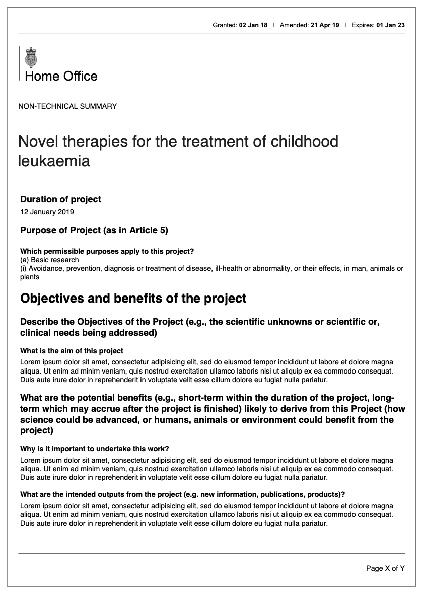

# Summary as of Wednesday 15 January 2020 

# Sprint 49

## Just Done
* Debrief to team of research findings - 5 year PIL review
* Design of NTS Download page
* Fix to SPOC "My task list" - some tasks weren't appearing
* Added shared key for ASRU
* Show licence fee estimation for ASRU - working software
* Widened PPL side-by-sdie comparison window

 

 

## About to Do/Doing
* Allow ASRU to correct a PIL start date - working software
* Allow ASRU to remove a PIL fee from an establishment prior to invoicing
* Design end-to-end 5 year PIL review process
* Schedule user research sessions with inspectors

## Bugs Fixed this week
The following bugs were fixed this week.
[Bug Fixes week to Wednesday 15 January 2020](graphs/bugs15012020.png)

We planned the following issues in this sprint 
[Sprint 49](graphs/sprint15012020.png)

## Support tickets and known issues
[Link to Support Board](https://collaboration.homeoffice.gov.uk/jira/secure/RapidBoard.jspa?rapidView=1717&selectedIssue=ASSB-253)

[Support board - cached](graphs/supportBoard15012020.png)

## Click here for metrics / progress against plan
[Sprint 49](graphs/progress15012020.png)

[Post Release Roadmap](graphs/roadmap15012020.png)

Our goals for the current sprint are:
1. Update Gov.uk content 
2. Billing - working software 
3. Design - NTS pdf download

## Sample Design Prototypes
***Initial designs for the print view of the NTS***
 

 

## Google Analytics for this report
[Google Analytics](graphs/GA15012020.png)

