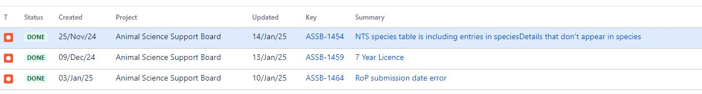

# Summary as of Wednesday 15th January 2025

## Future research and recruitment 

Thank you for your continued involvement in user research for ASPeL– your participation is integral to understanding the user experience. The research on ASPeL features continues. Please contact our user researcher David.utley@digital.homeoffice.gov.uk to participate. Thank you.  
 

Attribution:
Attribution:

Fun facts about Grizzly Bear:Meriwether Lewis and William Clarke: first described them as grisley, which could be interpreted as either "grizzly" (i.e., "grizzled"—that is, with grey-tipped hair) or "grisly" ("fear-inspiring", now usually "gruesome").

# Completed Sprint: 152(Grizzly Bear)

1) In preparation for improvements to protocols administration, we have defined editable content for standard protocols
2) We got NACWO and NVS guides published on GOV.UK to help those nominating Named persons for roles in establishments
3) We ensured that when endangered species in RoP has been selected on the form, this information cannot be changed later.
4) We added 2026 Bank Holidays to ASPeL

   

   

# Bugs Done or Closed this Sprint

# New Sprint: 153(Hoatzin)

Attribution:

 
Fun facts about Hoatzins: Hoatzins are seasonal breeders. They breed during the rainy season.

## Planned for this Sprint 153 (Hoatzin)
WE will;
1) Continue ASL Schema updates to improve ASPeL internally
2) Continue improvements to the establishments page on Gov.uk to ensure users can find information on ASPeL easily 
3) Continue improving Named Person nominations for establishments
5) Make improvements to NTS publishing
6) Improve user experience of updating protocols records and reusable steps
   

   

## Things to bear in mind
Kindly let us know how we are doing in keeping you informed. We appreciate your feedback on the content of this report. 

# Work in progress
1) All outstanding change highlighting errors within ASPeL such as 'changed flag displayed when no change has been made', date validity issues, and data errors are being worked on. 
  

   
 
   
## Support tickets and known issues
[Link to Support Board](https://collaboration.homeoffice.gov.uk/jira/secure/RapidBoard.jspa?rapidView=1717))

  

