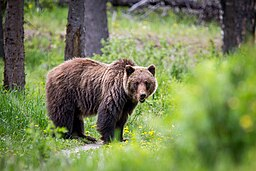

# Summary as of Wednesday 15th January 2025

## Future research and recruitment 

Thank you for your continued involvement in user research for ASPeL– your participation is integral to understanding the user experience. The research on ASPeL features continues. Please contact our user researcher David.utley@digital.homeoffice.gov.uk to participate. Thank you.  
 

Attribution:
Attribution:

Fun facts about Grizzly Bear:Meriwether Lewis and William Clarke: first described them as grisley, which could be interpreted as either "grizzly" (i.e., "grizzled"—that is, with grey-tipped hair) or "grisly" ("fear-inspiring", now usually "gruesome").

# Completed Sprint: 152(Grizzly Bear)

In preparation for improvements to protocols administration, we have defined editable content for standard protocols
We got NACWO and NVS guides published on GOV.UK to help those nominating Named persons for roles in establishments
We ensured endangered species in RoP once cited on the RoP form cannot be changed
We added 2026 Bank Holidays to ASPeL

   

   

# Bugs Done or Closed this Sprint
)

# New Sprint: 152(Grizzly Bear)

Attribution:

 
Fun facts about Grizzly Bear: Meriwether Lewis and William Clarke: first described them as grisley, which could be interpreted as either "grizzly" (i.e., "grizzled"—that is, with grey-tipped hair) or "grisly" ("fear-inspiring", now usually "gruesome"). 

## Planned for this Sprint 152 (Grizzly Bear)
WE will;
1) Continue work to improve licencing data description for annual reports
2) Continue ASL Schema updates to improve ASPeL internally
3) Continue improvements to the establishments page on Gov.uk 
4) Ensure animals already cited as endangered in RoP remain cited in other parts of the process for consistency.
5) Standardise authourisation for rehoming and set free to improve efficiencies in time and effort for users.
6) Continue Named Person improvements 
7) Make NTS publishing improvements
8) Design a single GA Standard protocol
9) Insert a link from a Named Person application page to the guides stored on the gov.uk site, for users' convenience.

   

   

## Things to bear in mind
Kindly let us know how we are doing in keeping you informed. We appreciate your feedback on the content of this report. 
We are always looking for external testers for new features on ASPeL, should you be interested, please get in touch using this email. david.utley@homeoffice.gov.uk

Thank you for your support in 2024, enjoy your festive break and looking forward to seeing you all in the New Year!

# Work in progress
1) All outstanding change highlighting errors within ASPeL such as 'changed flag displayed when no change has been made', date validity issues, and data errors. 
  

   
 
   
## Support tickets and known issues
[Link to Support Board](https://collaboration.homeoffice.gov.uk/jira/secure/RapidBoard.jspa?rapidView=1717))

  

The ASPeL team wish you all, the very best of the festive season and a Happy New Year!

