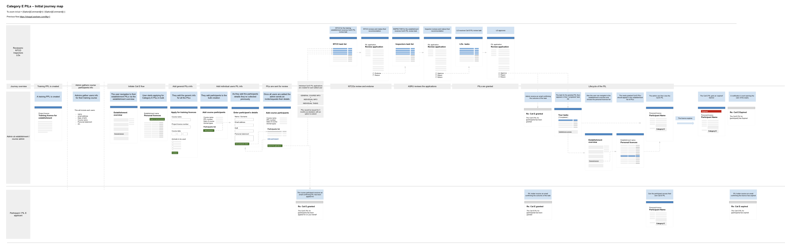

# Summary as of Wednesday 15 April 2020 

# Sprint 56

## Just Done
* Planned research for testing the Cat E PIL user journey.
* Held one user session.
* Content for PPL transfer success pages and export a .ppl
* Working softare - PPL collaboration - invite collaborators.
* Working software - Pdf document download of NTS.

## About to Do/Doing
* Improve performance of PDF rendering.
* Holding two user sessions by the end of this week.
* Content for users adding or removing information in protocols that impacts other areas of the application.
* Working software - email notification PPL collaboration invitation

## Bugs Fixed this week
The following bugs were fixed this week.
[Bug Fixes week to Wednesday 15 April 2020](graphs/bugs15042020.png)

We planned the following issues in this sprint 
[Sprint 55](graphs/sprint15042020.png)

## Support tickets and known issues
[Link to Support Board](https://collaboration.homeoffice.gov.uk/jira/secure/RapidBoard.jspa?rapidView=1717&selectedIssue=ASSB-253)

[Support board - cached](graphs/supportBoard15042020.png)

## Click here for metrics / progress against plan
[Sprint 55](graphs/progress15042020.png)

[Post Release Roadmap](graphs/roadmap15042020.png)

Our goals for the previous sprint were:
1. Add PPL Holder Training ***[Not started]***
2. Category E PILs – Design ***[Done]***
3. ASRU Reporting ***[Started]***
4. Plan Category E PIL research ***[Done]***

Our goals for the current sprint are:
1. Set up PIL E Research 
2. Design - Prototype PIL E user journey 
3. Agree approach for Training and Education PPLs

## Sample Design Prototypes

 

## Google Analytics for this report
[Google Analytics](graphs/GA15042020.png)

