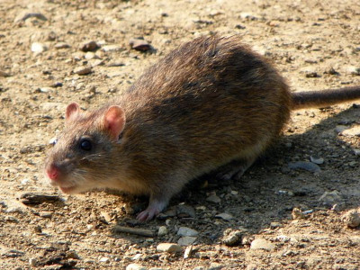

# Summary as of Wednesday 15 June 2022 

# Sprint 111 (Rat)

## Just Done
* First draft - technical documentation
* Content changes - Global changes to PPL applications/amendments - working software

## About to Do/Doing
* Initial investigations into suspending licences - design
* Operational Improvement: Set deadlines for time based conditions - working software

## Bugs Fixed this week
The following bugs were fixed this week.
[Bug Fixes week to Wednesday 15 June 2022](graphs/bugs15062022.png)

We planned the following issues in this sprint 
[Sprint 111](graphs/sprint15062022.png)

## Support tickets and known issues
[Link to Support Board](https://collaboration.homeoffice.gov.uk/jira/secure/RapidBoard.jspa?rapidView=1717&selectedIssue=ASSB-253)

[Support board - cached](graphs/supportBoard15062022.png)

## Click here for metrics / progress against plan
[Sprint 111](graphs/progress15062022.png)

[Post Release Roadmap](graphs/roadmap15062022.png)

1. Time conditions: release candidate - working software 
2. Prepare for enablers show and tell - design

## Google Analytics for this report
[Google Analytics](graphs/GA15062022.png)

