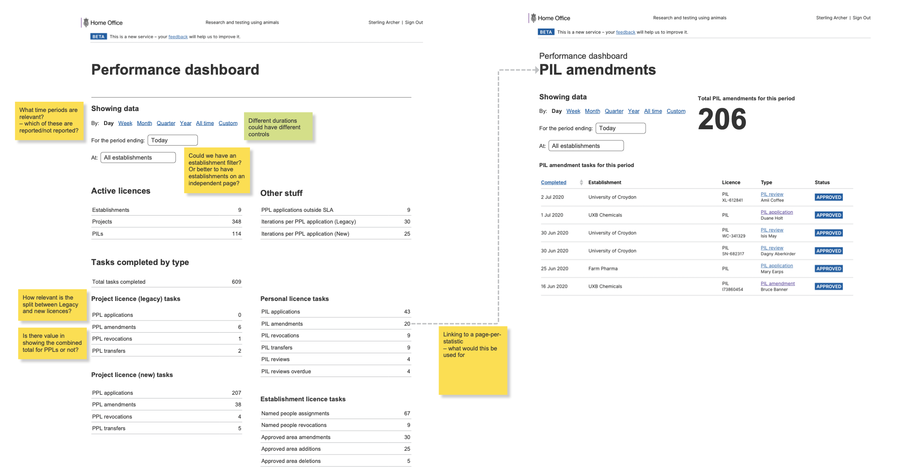

# Summary as of Wednesday 15th July 2020 

# Sprint 62

## Just Done
* Change password functionality - working software
* Soft launch of new search engine - working software
* Performance improvements to PDF renderer - working software
* Completed desk research into RAs - user research
* Identified establishments to contact for research into Retrospective Assessments - user research

## About to Do/Doing
* Show RA status in project lists - working software
* New questions for training and education PPLs - working software
* Allow moving draft PPLs between establishments - working software
* Rebuild/redesign of users’ training certificates in PIL application and profiles - working software
* Show remaining users in role when unassigning named roles - working software
* Planning research sessions for Retrospective Assessments with establishments and ASRU - user research
* Improvements to the performance metrics page - design

## Bugs Fixed this week
The following bugs were fixed this week.
[Bug Fixes week to Wednesday 08 July 2020](graphs/bugs15072020.png)

We planned the following issues in this sprint 
[Sprint 62](graphs/sprint15072020.png)

## Support tickets and known issues
[Link to Support Board](https://collaboration.homeoffice.gov.uk/jira/secure/RapidBoard.jspa?rapidView=1717&selectedIssue=ASSB-253)

[Support board - cached](graphs/supportBoard15072020.png)

## Click here for metrics / progress against plan
[Sprint 62](graphs/progress15072020.png)

[Post Release Roadmap](graphs/roadmap15072020.png)

## These are the goals for the current sprint:

1. User needs research for retrospective assessments 
2. Design and content - improvements to the performance metrics page 
3. Working software - change password

## Sample Design Prototypes
###  Adding secondary availability to PPLs in data

 

## Google Analytics for this report
[Google Analytics](graphs/GA15072020.png)

