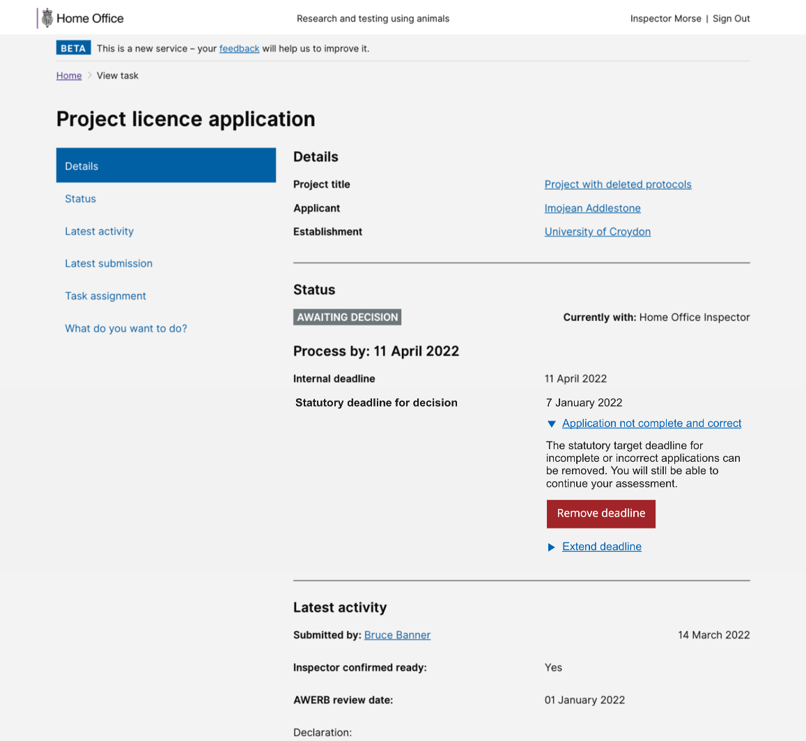

# Summary as of Wednesday 16 March 2022 

# Sprint 105 (Llama)

## Just Done
* Initial designs for allowing ASRU to mark applications as not 'complete and correct' - design
* New metrics and reporting pages - working software
* Fix issue with task search pages not loading for internal users - working software

## About to Do/Doing
* Updates to the "refuse a PPL" journey - design
* Time based conditions - design
* Building interfaces and data stores for non-compliance case functionality
* Fix issue with removed named people still showing on schedule of premises
* Handover documentation - service handover

## We planned the following issues in this sprint 
[Sprint 105](graphs/sprint16032022.png)

## Support tickets and known issues
[Link to Support Board](https://collaboration.homeoffice.gov.uk/jira/secure/RapidBoard.jspa?rapidView=1717&selectedIssue=ASSB-253)

[Support board - cached](graphs/supportBoard16032022.png)

## Click here for metrics / progress against plan
[Sprint 105](graphs/progress16032022.png)

[Post Release Roadmap](graphs/roadmap16032022.png)

## We set the following goals for this sprint
1. Enforcement flags - release candidate - working software 
2. Time-based conditions - design

## These were the goals for the previous sprint
1. Release candidate for new metrics pages ***[Done]***
2. Designs for changes to complete and correct functionality ***[Done]***

## Sample Design Prototypes
### Initial designs for allowing ASRU to mark applications as not 'complete and correct'

 

## Google Analytics for this report
[Google Analytics](graphs/GA16032022.png)

