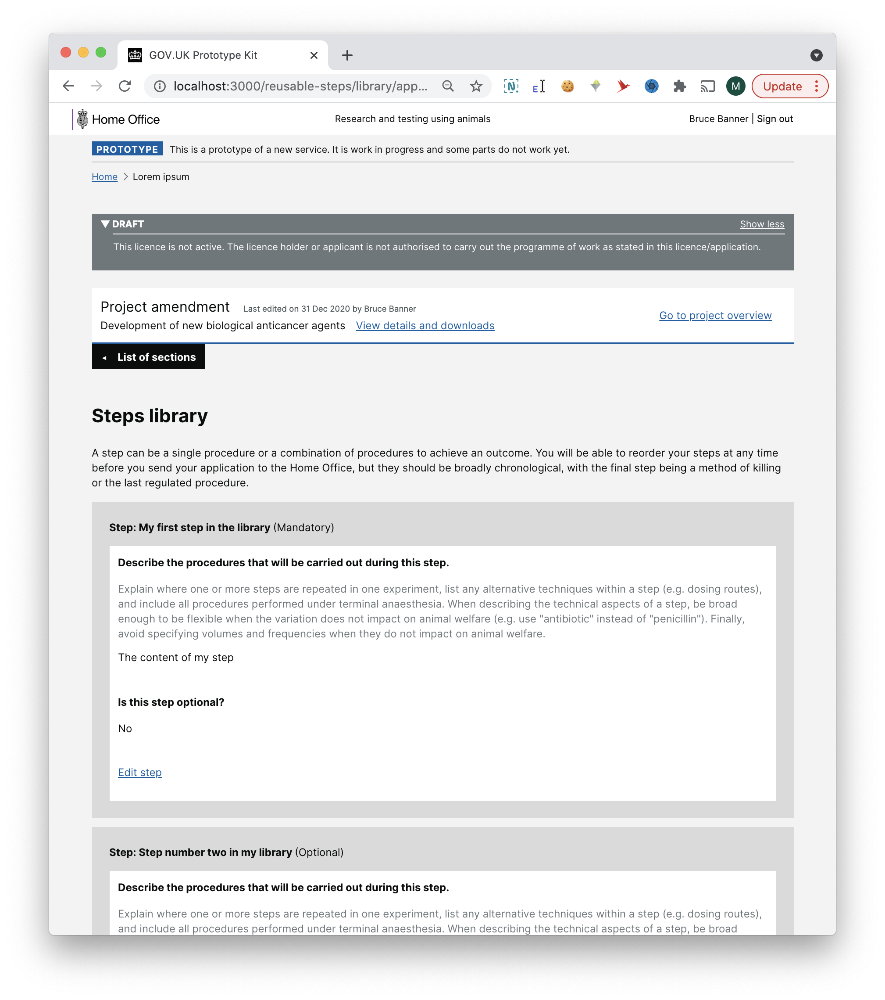

# Summary as of Wednesday 16 June 2021 

# Sprint 86

## Just Done
* TEXT_HERE
* TEXT_HERE
* TEXT_HERE

## About to Do/Doing
* TEXT_HERE
* TEXT_HERE
* TEXT_HERE

## Bugs Fixed this week
The following bugs were fixed this week.
[Bug Fixes week to Wednesday 16 June 2021](graphs/bugs16062021.png)

We planned the following issues in this sprint 
[Sprint 86](graphs/sprint16062021.png)

## Support tickets and known issues
[Link to Support Board](https://collaboration.homeoffice.gov.uk/jira/secure/RapidBoard.jspa?rapidView=1717&selectedIssue=ASSB-253)

[Support board - cached](graphs/supportBoard16062021.png)

## Click here for metrics / progress against plan
[Sprint 86](graphs/progress16062021.png)

[Post Release Roadmap](graphs/roadmap16062021.png)

1) Prepare designs for reusable component testing - research and design 2) Cached version of ASRU licence fees - working software (Scorpion)

1) Collaborator edit access on PPLs - working software 2) Initial designs for re-usable components - design Rhinoceros

## Sample Design Prototypes

 

 

## Google Analytics for this report
[Google Analytics](graphs/GA16062021.png)

