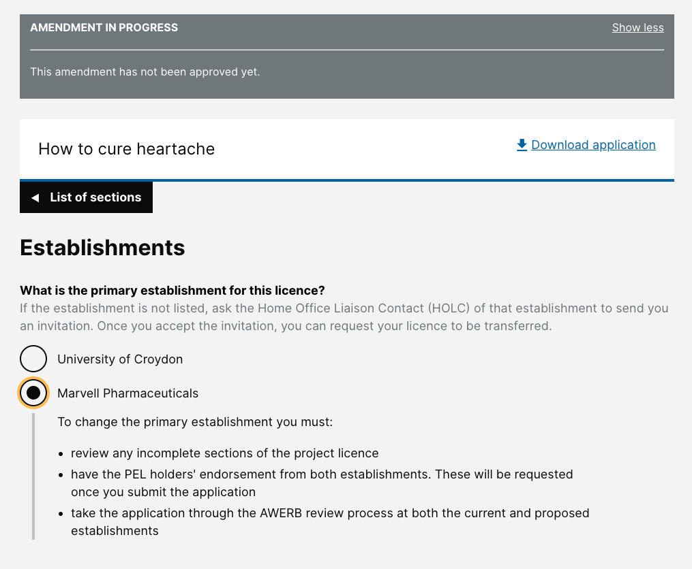
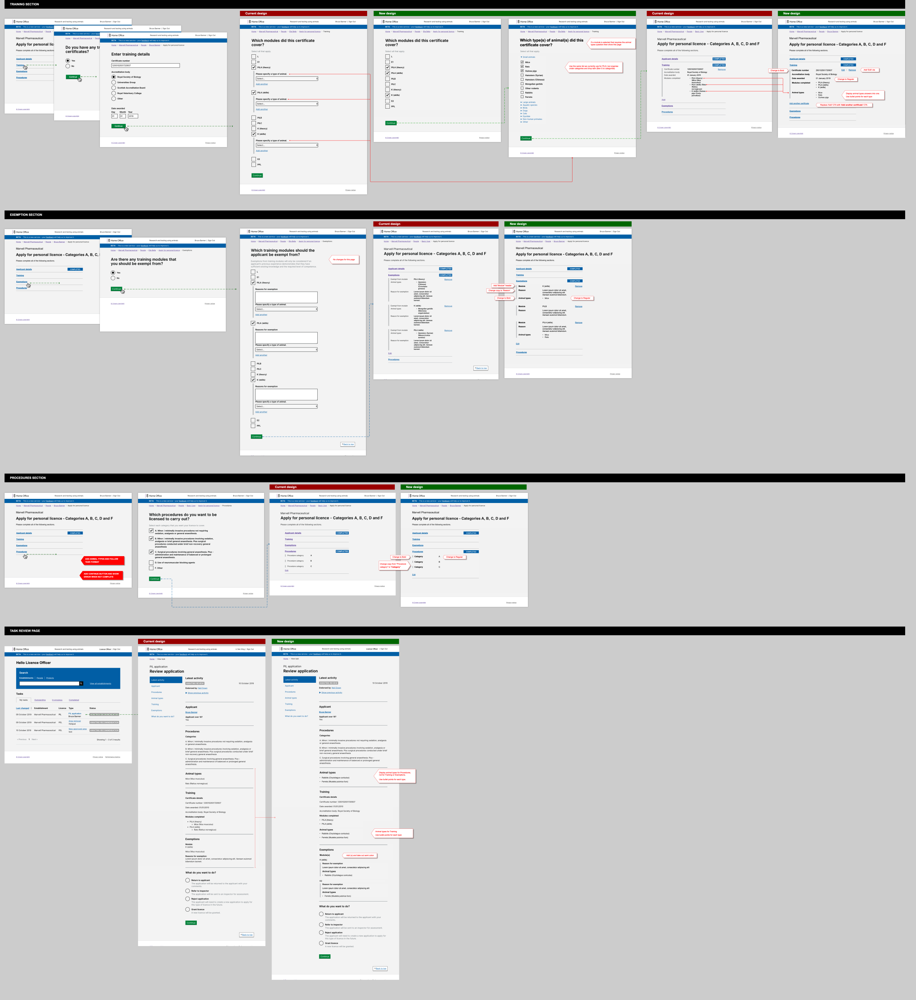

# Summary as of Wednesday 16 October 2019 

# Sprint 44

## Just Done
* Editing comments
* Re-ordering and duplicating protocols
* Concluded last round of PIL and PPL transfer research

## About to Do/Doing
* PPL application admin approval
* Edit email address
* Billing exploration / requirements gathering

## Things to be aware of
* One of the designers will leave the team at the end of the week

## Bugs Fixed this week
[Bug Fixes week to Wednesday 16 October 2019](graphs/bugs16102019.jpg)

[Post Release Roadmap](graphs/roadmap16102019.jpg)

We planned the following issues in this sprint 

[Sprint 44](graphs/sprint16102019.png)

## Support tickets and known issues
[Link to Support Board](https://jira.digital.homeoffice.gov.uk/secure/RapidBoard.jspa?rapidView=331&selectedIssue=ALS-47)

[Support board - cached](graphs/supportBoard16102019.jpg)

## Click here for metrics / progress against plan
[Sprint 44](graphs/progress16102019.png)

## Our goals for the previous sprint were:
Our goals for the current sprint are:
1. Transfer PILs and PPLs between establishments, UR & Design ***\[Done\]***
2. PPL Approval - working software ***\[In progres\]***

## Our goals for the current sprint are:
1. User Research - explore billing 
2. Design - interface and content improvements 
3. Allow users to change email address - working sofware

## Sample Design Prototypes

 

 

## Google Analytics for this report
[Google Analytics](graphs/GA16102019.jpg)

