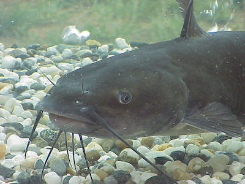

# Summary as of Wednesday 16 November 2022 

# Sprint 122 (Catfish)

### These are the areas of focus for the current sprint
1. Design Handover
2. Delivery Manager Handover
3. Update all containers to Node v18

## Things to bear in mind
The Marvell Consulting team roll off the project on 17th November, thank you Marvell for all your hard work and for making the handover smooth! The new team are looking forward to working on the product.

## Just Done
* Delivered latest version of ASPeL usage documentation - documentation
* Completed design and user research handovers - documentation
* Updated images to Node version 18 - working software
* Improved automated error alerting and moved notifications Home Office channels - working software

## About to Do/Doing
* Document Upload Discovery/Research - research
* Designing how to integrate PPL guidance notes into the forms - design
* Allow changes to PEL conditions as part of a PEL amendment - working software

## Bugs Fixed this week
The following bugs were fixed this week.
[Bug Fixes week to Wednesday 16 November 2022](graphs/bugs16112022.png)

We planned the following issues in this sprint 
[Sprint 122](graphs/sprint16112022.png)

## Support tickets and known issues
[Link to Support Board](https://collaboration.homeoffice.gov.uk/jira/secure/RapidBoard.jspa?rapidView=1717)

## Click here for metrics / progress against plan

We have decided to remove progress metrics from the weekly report. Over time as ASPeL has become a more mature product, the ratio of in-progress to completed tasks has become less useful as a metric. We will continue to share updates on sprint goals, what's in progress and what's just been completed.

The release roadmap has been temporarily removed. As part of the handover from Marvell to the Home Office team it will be reviewed and may be presented in a new format.

## Google Analytics for this report
Google Analytics reporting has been paused for this weekly report. We may re-introduce viewing statistics for the weekly report in future using Google Analytics or another tool.
