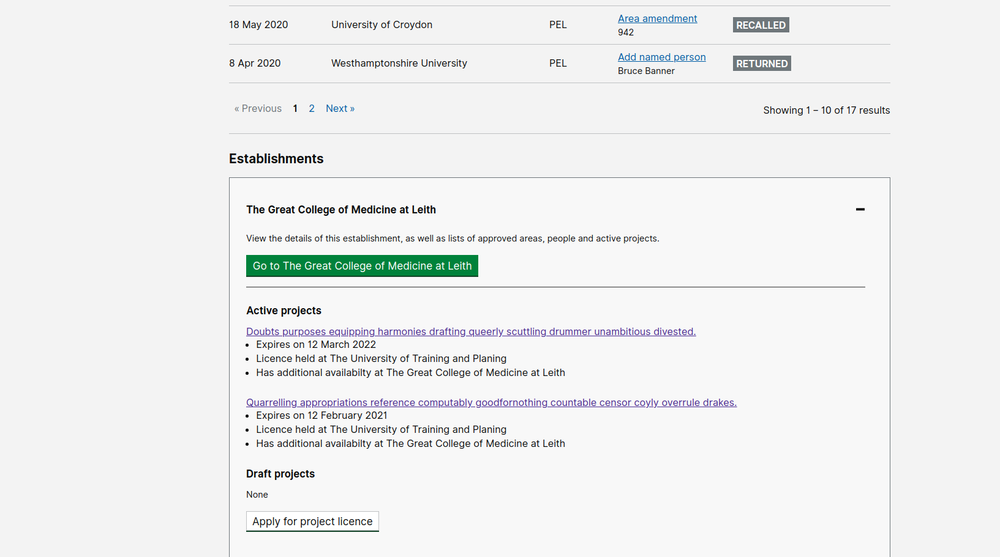

# Summary as of Wednesday 16 December 2020 

# Sprint 73.5 &#x1f98a;

## Just Done
* TEXT_HERE
* TEXT_HERE
* TEXT_HERE

## About to Do/Doing
* TEXT_HERE
* TEXT_HERE
* TEXT_HERE

## Bugs Fixed this week
The following bugs were fixed this week.
[Bug Fixes week to Wednesday 16 December 2020](graphs/bugs16122020.png)

We planned the following issues in this sprint 
[Sprint 73.5](graphs/sprint16122020.png)

## Support tickets and known issues
[Link to Support Board](https://collaboration.homeoffice.gov.uk/jira/secure/RapidBoard.jspa?rapidView=1717&selectedIssue=ASSB-253)

[Support board - cached](graphs/supportBoard16122020.png)

## Click here for metrics / progress against plan
[Sprint 73.5](graphs/progress16122020.png)

[Post Release Roadmap](graphs/roadmap16122020.png)

## We set the following goals for this sprint:
1. Test ROPs with internal users - design and user research 
2. Release PPL for content search for ASRU - working software &#x1f98a; 

## Sample Design Prototypes

 

 

## Google Analytics for this report
[Google Analytics](graphs/GA16122020.png)

