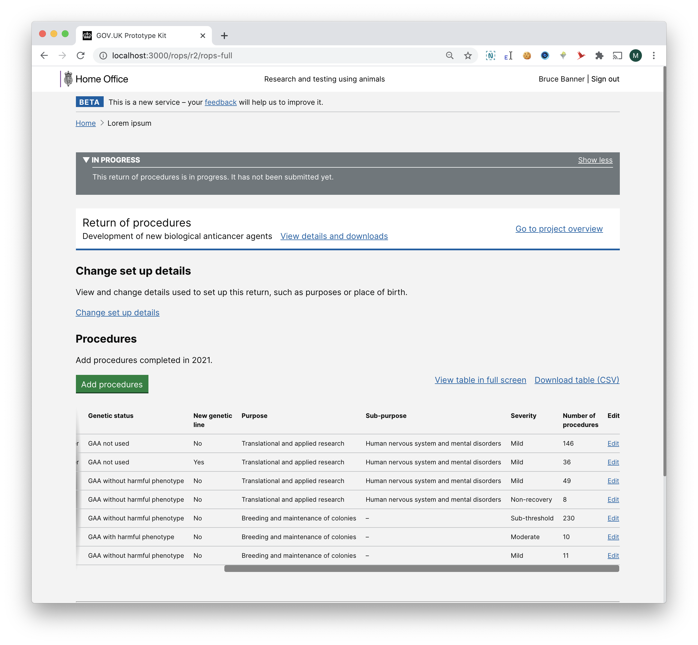

# Summary as of Wednesday 17 February 2021 

# Sprint 78 (Komodo Dragon)

 

## Things to be aware of
* Our product manager will gradually move off the project in the coming months. A replacement will be recruited and a slow and careful handover will take place.

## Just Done
* RoPs summary of findings - user research
* ASRU can now view a list of all completed tasks by type (e.g. all PIL applications) linked from the performance metrics - working software
* Added hint text to application PDF - working software
* CSV download for operational newsletter subscribers - working software

## About to Do/Doing
* Animals in Science case study for HO DDaT use - user research
* Planning user research for PPL rejection journey - user research
* Show correct licence holder on historic licence versions (i.e. pre-licence-holder change) - working software

## Bugs Fixed this week
The following bugs were fixed this week.
[Bug Fixes week to Wednesday 17 February 2021](graphs/bugs17022021.png)

We planned the following issues in this sprint 
[Sprint 78](graphs/sprint17022021.png)

## Support tickets and known issues
[Link to Support Board](https://collaboration.homeoffice.gov.uk/jira/secure/RapidBoard.jspa?rapidView=1717&selectedIssue=ASSB-253)

[Support board - cached](graphs/supportBoard17022021.png)

## Click here for metrics / progress against plan
[Sprint 78](graphs/progress17022021.png)

[Post Release Roadmap](graphs/roadmap17022021.png)

1. ROP - create a return of procedures - working software 2. Understand user needs for ppl rejection - user research (Komodo Dragon)

1) Summarize the findings from RoPs testing with external users - agree improvements 2) Performance metrics filtered task lists - working software 3) Delivery plan for RoPs - (Jaguar)

## Sample Design Prototypes

 

 

## Google Analytics for this report
[Google Analytics](graphs/GA17022021.png)

