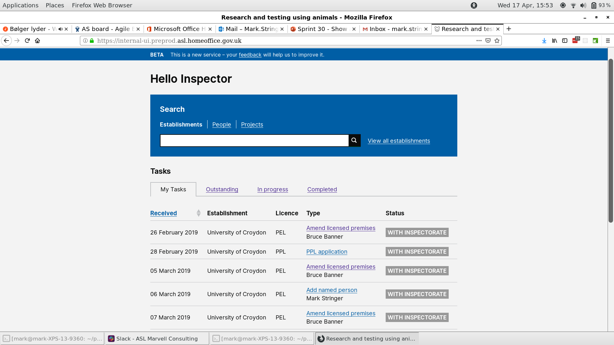
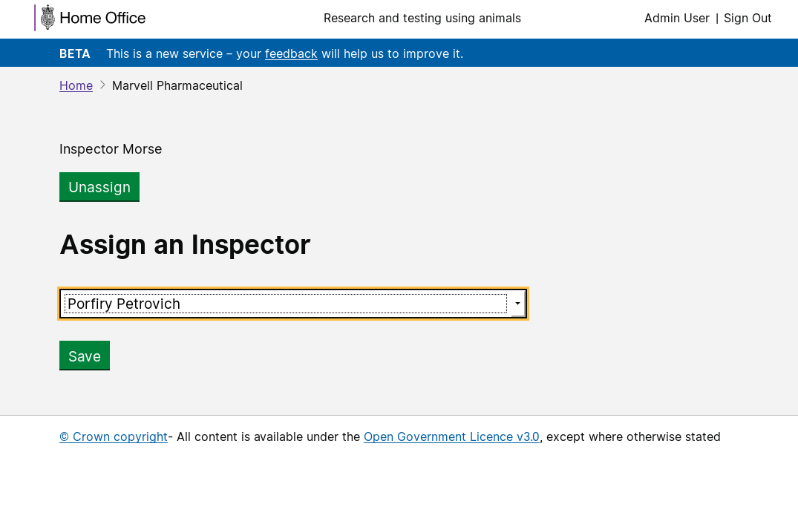

# Summary as of 17th April 2019 

# Sprint 31 

## Just Done
* License status banners for digital
* PDF export of Protocols in legacy license
* "My Tasks" tab for internal users

## About to Do/Doing
* Licence status banners for print
* Per question commenting on PPL applications and amendments
* Comparison of PPL Versions

## Things to be aware of
* Several members of the team are away on holiday during this sprint 

## Click here for Prioritised Road Map
[Prioritised Road Map](https://trello.com/b/p7x9hbPV/prioritised-roadmap)    [\(Cached Image\)](graphs/ASLRoadMap17042019.jpg)

## Click here for metrics / progress against plan
[Week 1 - Sprint 31 - Release 1](graphs/progress17042019.png)

## Burnup Chart

[Burnup Chart](burnup17042019.md)

## Risks
[Links to Project Risks in Trello](https://trello.com/b/VuFuCL7t/risk-register-and-kpis-asl-delivery) 
[Link to Risk Chart](graphs/risk17042019.png)

## Sprint Planning
* We planned the following issues in sprint planning today [Link to Issues in Jira](https://jira.digital.homeoffice.gov.uk/secure/RapidBoard.jspa?rapidView=261)    [\(Cached Image\)](graphs/sprint17042019.png)

1. Our goals for the previous sprint were:
2. Design view of licences - PPLs \[Done - next Show and Tell\]
3. User research - requirements for other kinds of PPL \[In progress\]
4. "My tasks" list - working software \[Done\]
5. pdf export of PPLs \[In progress\]

Our goals for the sprint are:
1. Content design for PPL applications 
2. Per question commenting on PPL applications and amendments

## Sample Design Prototype
## Screenshots of the PPL application prototype

 

 

## Google Analytics for this report

This shows:
* total number of users
* number of new users

[Google Analytics](graphs/GA17042019.jpg)

