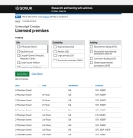

# Summary as of 17th May 2018 
## What's Blocking us / Issues
* Access to data will soon become the limiting fact on the speed of development.

## Just Done
* Understand needs around amendments and approval concept journey - user research conducted with inspectors and HOLCs
* View licence premises, Establishment User demonstrated working software at "Show and Tell."
* Updated profile page design

## About to Do/Doing
* Design and Validate View All Project Licences
* Develop working softwer for remaining aspected of View Establishment Licence
* Test prototypes for Establisment Licence modification with HOLC's

## Things to be aware of
* The Alpha service assessment for the project will be next Friday 25th March

## Click here for our High-Level Road map
[Link to Live Road map in Trello](https://trello.com/b/gDQdE01u/asl-roadmap)    [\(Cached Image\)](graphs/ASLRoadMap17052018.jpg)

## Click here for metrics / progress against plan
[Sprint 8 - Week 1 - Release 1](graphs/progress17052018.png)

## Risks
[Links to Project Risks in Trello](https://trello.com/b/VuFuCL7t/risk-register-and-kpis-asl-delivery)    [\(Cached Image\)](graphs/ASLRiskRegister17052018.jpg)

[Risk Management Chart](graphs/risk17052018.png)

## Sprint Planning
* We planned the following issues in sprint planning today [Link to Issues in Jira](https://jira.digital.homeoffice.gov.uk/secure/RapidBoard.jspa?rapidView=261)    [\(Cached Image\)](graphs/sprint17052018.png)
Our three goals for the sprint are
* Pass Alpha service assessment
* Get 'Development Ready' PEL Amendments journey for establishment users
* To have developed working software for all View Establishment Licences for Internal and External Users

## Demonstration of working software
* View Establishment Details and Licenced Premises [https://public-ui.notprod.asl.homeoffice.gov.uk/](https://public-ui.notprod.asl.homeoffice.gov.uk/)

Username: holc
Password: holc

